# BPMN Tracking Field Lineage

## Business Summary

### Objective

Mô hình hóa As-Is workflow cho luồng đi của các field tracking khi user click shortlink trong 3 trường hợp:

- Click từ social trực tiếp vào shortlink.
- Click từ website có gắn `atp.js`, trong website có gắn shortlink.
- Click từ website không gắn `atp.js`, trong website có gắn shortlink.

Các field được theo dõi:

- `ip`
- `ua` / `userAgent`
- `referrer`
- `fbp/fbc` trên website nguồn
- `fbclid` từ URL website nguồn
- `fbc` lưu trên `ClickEvent`
- `fbp/fbc` bridge

### Scope

Phạm vi tài liệu chỉ bao gồm tracking click qua shortlink và bridge page. Tài liệu không mô hình hóa luồng affiliate postback, CAPI worker delivery chi tiết, dashboard analytics, hay billing quota ngoại trừ điểm tạo `ClickEvent`.

### Assumptions

- Shortlink public có dạng `/:slug/:tenantKey` trên redirect service.
- `atp.js` chỉ chạy được trên domain đã whitelist.
- Cookie `_fbp`, `_fbc`, `_ttp` là cookie theo domain, không tự chuyển từ website nguồn sang redirect/bridge domain.
- Facebook/social click trực tiếp vào shortlink thường có `fbclid` trên chính URL shortlink.
- Website không có `atp.js` thì hệ thống không đọc được cookie website nguồn.
- Bridge cookie fallback chỉ được phép chạy khi click không có `metadata.sourceAttribution = 'atp.js'`.

### Business Actors

- Visitor Browser: trình duyệt của user.
- Social Platform: Facebook hoặc nguồn social có thể gắn `fbclid` vào shortlink.
- Source Website: website/landing page chứa shortlink.
- Tracking Script `atp.js`: script chạy trên Source Website nếu được gắn.
- Redirect Service: service xử lý shortlink và bridge page.
- Browser Pixel: Meta/TikTok pixel chạy trên bridge/direct HTML nếu campaign có dataset/pixel.
- Database: nơi lưu `ClickEvent`.
- Affiliate Destination: URL affiliate cuối cùng sau redirect.

### Systems

- `apps/api/src/server.ts`: phát `atp.js` và xử lý tracking event cho afflink trần.
- `apps/redirect/src/server.ts`: xử lý shortlink, tạo `ClickEvent`, render bridge/direct HTML, update bridge attribution.
- `packages/db/prisma/schema.prisma`: định nghĩa `ClickEvent` fields.

### Start Event

Visitor bắt đầu bằng một trong ba hành động:

- Click shortlink trực tiếp từ social.
- Click shortlink trên website có `atp.js`.
- Click shortlink trên website không có `atp.js`.

### End Event

- `ClickEvent` được tạo với field attribution tốt nhất theo rule ưu tiên.
- Browser được redirect sang Affiliate Destination.

### Business Phases

- Source Detection
- Attribution Capture
- Shortlink Request
- ClickEvent Creation
- Bridge Cookie Fallback
- Affiliate Redirect

## BPMN Summary

### Pools And Lanes

| Pool | Lane | Responsibility |
|---|---|---|
| Visitor Journey | Visitor Browser | Click link, carry request headers, execute HTML/JS |
| Traffic Source | Social Platform | Add `fbclid` to direct social shortlink click |
| Traffic Source | Source Website | Host shortlink, optionally host `atp.js` |
| Tracking Platform | `atp.js` | Read website cookies/query and decorate shortlink |
| Tracking Platform | Redirect Service | Create `ClickEvent`, render bridge/direct redirect, receive bridge fallback |
| Tracking Platform | Browser Pixel | Set bridge-domain cookies after pixel initialization |
| Data Store | Database | Persist `ClickEvent` fields |
| External Destination | Affiliate Destination | Receive final affiliate URL with tracking param/click UUID |

### Activities

| Activity | Actor | Input | Output | Manual/System | Dependencies |
|---|---|---|---|---|---|
| User clicks shortlink from social | Visitor Browser | Social post/ad link | Request to redirect service | System | Social link exists |
| Social appends `fbclid` | Social Platform | Outbound URL | Shortlink URL with `fbclid` | System | Social platform behavior |
| Website renders shortlink | Source Website | Page HTML | Clickable shortlink | System | Website page exists |
| `atp.js` scans DOM | `atp.js` | Page DOM, configured tracking links | Matching shortlink detection | System | Domain whitelist and script installed |
| `atp.js` reads website cookies | `atp.js` | `document.cookie`, page URL | `_fbp`, `_fbc`, `_ttp`, `fbclid`, `ttclid` | System | Cookies are not `HttpOnly` |
| `atp.js` decorates shortlink | `atp.js` | Shortlink URL, website attribution | `atp_source=1`, `atp_fbp`, `atp_fbc`, `atp_ttp`, `fbclid`, `ttclid` | System | Shortlink detected |
| Redirect service receives shortlink | Redirect Service | HTTP request | Normalized query/header values | System | User click |
| Redirect service creates `ClickEvent` | Redirect Service | Request headers/query/source attribution | `ClickEvent` row | System | TrackingLink active |
| Bridge/direct page cleans source params | Redirect Service + Browser | HTML response with cleanup script | URL without `atp_*` source params | System | HTML response path used |
| Browser pixel initializes on bridge | Browser Pixel | Pixel script, browser context | Bridge-domain `_fbp/_fbc/_ttp` may be set | System | Campaign has browser pixel dataset |
| Bridge fallback posts cookie attribution | Visitor Browser | Bridge-domain cookies | POST `/_atp/bridge-attribution` | System | Fallback enabled |
| Redirect service updates bridge attribution | Redirect Service | Bridge fallback payload | Updated `ClickEvent.fbp/fbc/ttp` | System | No `atp.js` source attribution |
| Redirect to affiliate URL | Redirect Service + Browser | Affiliate URL + `clickUuid` tracking param | Final navigation | System | `ClickEvent` created |

### Gateways

| Gateway | Named Branches | Business Rule |
|---|---|---|
| Traffic source? | Social Direct / Website With `atp.js` / Website Without `atp.js` | Determines available attribution source |
| `atp.js` installed and active? | YES / NO | YES can read website cookies and URL query; NO cannot |
| Shortlink request has `atp_source=1` or `atp_*`? | YES / NO | YES means website-source attribution exists |
| Shortlink has `fbclid`? | YES / NO | YES can build server-side `fbc` if no source `fbc` exists |
| Bridge/pixel page rendered? | YES / NO | YES can attempt bridge cookie fallback |
| Existing source attribution is `atp.js`? | YES / NO | YES bridge fallback must skip overwrite |
| Bridge cookies available? | YES / NO | YES update `ClickEvent`; NO no fallback values |

## Field Lineage Rules

### Global Priority

1. Website source attribution from `atp.js`: `atp_fbp`, `atp_fbc`, `atp_ttp`, propagated `fbclid`, propagated `ttclid`.
2. Query directly present on shortlink: `fbclid`, `ttclid`, optional fallback `fbp/fbc/ttp`.
3. Bridge cookie fallback: `_fbp`, `_fbc`, `_ttp` from redirect/bridge domain, only when source attribution is not `atp.js`.
4. Request headers for transport fields: `ip`, `ua`, `referrer` always come from request into redirect service.

### Field Matrix

| Field | Case 1: Social Direct To Shortlink | Case 2: Website With `atp.js` + Shortlink | Case 3: Website Without `atp.js` + Shortlink |
|---|---|---|---|
| `ip` | Redirect request header chain | Redirect request header chain | Redirect request header chain |
| `ua` / `userAgent` | Redirect request `user-agent` | Redirect request `user-agent` | Redirect request `user-agent` |
| `referrer` | Browser `referer`, may be social or absent | Browser `referer`, usually website page | Browser `referer`, usually website page |
| Website `_fbp/_fbc` | Not applicable | Read by `atp.js` from website domain | Not available to tracking system |
| `fbclid` from website URL | Not applicable unless social URL itself is source page | Read by `atp.js` from `window.location.href` and propagated to shortlink | Not available unless website manually appends it to shortlink |
| `fbclid` on shortlink | Usually present from social | Present if `atp.js` propagated or shortlink already had it | Present only if manually included in shortlink |
| Initial `ClickEvent.fbc` | `createFbc(fbclid)` if shortlink has `fbclid` | `atp_fbc` first, else `createFbc(fbclid)` | `createFbc(fbclid)` only if shortlink has `fbclid` |
| Initial `ClickEvent.fbp` | Empty unless query fallback exists | `atp_fbp` | Empty unless query fallback exists |
| Bridge `_fbp/_fbc` | Allowed fallback; can update `ClickEvent` | Not allowed to overwrite `atp.js` source attribution | Allowed fallback if bridge/pixel renders |
| Final attribution source marker | `bridge` if bridge fallback posts cookies; otherwise `redirect` | `atp.js` | `bridge` if bridge fallback posts cookies; otherwise `redirect` |

### Field-Level Detail

#### `ip`

- Source: redirect service request.
- Resolution order: `cf-connecting-ip`, `true-client-ip`, `x-real-ip`, `x-forwarded-for`, `req.ip`.
- Same behavior for all three cases.
- Stored in `ClickEvent.ip`.

#### `ua` / `userAgent`

- Source: `user-agent` header on the request to shortlink.
- Same behavior for all three cases.
- Stored in `ClickEvent.userAgent`.

#### `referrer`

- Source: `referer` header on the request to shortlink.
- Case 1: may be social app/browser URL or absent depending on social/browser privacy policy.
- Case 2: usually Source Website URL.
- Case 3: usually Source Website URL.
- Stored in `ClickEvent.referrer`.
- Current rule does not parse `fbclid` from `referrer` unless `atp.js` exists and propagated it.

#### `fbp/fbc` On Website

- Source: Source Website domain cookies `_fbp` and `_fbc`.
- Only accessible to JavaScript running on Source Website.
- Case 2 only: `atp.js` reads these values and writes them into shortlink query as `atp_fbp` and `atp_fbc`.
- Case 1: no Source Website exists in path.
- Case 3: Source Website may have cookies, but tracking system cannot read them without `atp.js`.

#### `fbclid` From Website URL

- Source: `window.location.href` on Source Website.
- Case 2: `atp.js` reads `fbclid` and adds it to shortlink if the shortlink does not already have `fbclid`.
- Case 3: not available to redirect service unless website manually appends it to shortlink.
- Redirect service uses only query on the shortlink request, not query from referrer URL.

#### `fbc`

- Priority:
- First: `atp_fbc` from Source Website via `atp.js`.
- Second: fallback query `fbc` if explicitly present.
- Third: synthetic `createFbc(fbclid)` if shortlink request has `fbclid`.
- Fourth: bridge `_fbc` fallback, only when source attribution is not `atp.js` and bridge posts cookies back.

#### `fbp/fbc` Bridge

- Source: redirect/bridge domain cookies after bridge/direct HTML and browser pixel run.
- Allowed only when click does not have `metadata.sourceAttribution = 'atp.js'`.
- Bridge fallback posts to `/_atp/bridge-attribution` with `clickUuid`, `fbp`, `fbc`, `ttp`.
- Redirect service skips fallback if `metadata.sourceAttribution = 'atp.js'`.
- Bridge fallback is a recovery path for Case 1 and Case 3, not the primary source for Case 2.

## Case Workflows

### Case 1: Social Direct To Shortlink

1. Social Platform presents shortlink to visitor.
2. Social Platform may append `fbclid` to shortlink.
3. Visitor Browser requests shortlink.
4. Redirect Service reads `ip`, `ua`, `referrer`, `fbclid`, `ttclid` from request.
5. Redirect Service creates `ClickEvent`.
6. If `fbclid` exists and no source `fbc` exists, Redirect Service creates `fbc` using `createFbc(fbclid)`.
7. If bridge/direct HTML with pixel renders, Browser Pixel may set bridge-domain `_fbp/_fbc`.
8. Bridge fallback posts bridge-domain cookies to Redirect Service.
9. Redirect Service updates `ClickEvent.fbp/fbc/ttp` and marks `sourceAttribution = 'bridge'`.
10. Browser redirects to Affiliate Destination with `clickUuid` in affiliate tracking param.

### Case 2: Website With `atp.js` And Shortlink

1. Source Website loads page and `atp.js`.
2. `atp.js` verifies config and scans DOM for shortlink.
3. `atp.js` reads website-domain `_fbp/_fbc/_ttp` and `fbclid/ttclid` from website URL or link URL.
4. `atp.js` decorates shortlink with `atp_source=1`, `atp_fbp`, `atp_fbc`, `atp_ttp`, `fbclid`, and `ttclid`.
5. Visitor Browser requests decorated shortlink.
6. Redirect Service creates `ClickEvent` with website-source attribution and marks `sourceAttribution = 'atp.js'`.
7. Redirect/direct HTML removes `atp_*` source query params from visible URL.
8. Bridge fallback is disabled from overwriting because source attribution is `atp.js`.
9. Browser redirects to Affiliate Destination with `clickUuid` in affiliate tracking param.

### Case 3: Website Without `atp.js` And Shortlink

1. Source Website renders a shortlink without tracking script assistance.
2. Visitor Browser requests shortlink.
3. Redirect Service reads `ip`, `ua`, `referrer`, and only query that exists on the shortlink itself.
4. Website-domain `_fbp/_fbc` and website URL `fbclid` are not available to redirect service.
5. Redirect Service creates `ClickEvent`.
6. If the shortlink itself has `fbclid`, Redirect Service creates synthetic `fbc` using `createFbc(fbclid)`.
7. If bridge/direct HTML with pixel renders, Browser Pixel may set bridge-domain `_fbp/_fbc`.
8. Bridge fallback may update `ClickEvent.fbp/fbc/ttp` and mark `sourceAttribution = 'bridge'`.
9. Browser redirects to Affiliate Destination with `clickUuid` in affiliate tracking param.

## Process Problems

- 🔵 Missing Data: In Case 3, website-domain `_fbp/_fbc` cannot be collected because no script runs on the Source Website.
- 🔵 Missing Data: Redirect service does not parse `fbclid` from `referrer`; it only uses query on the shortlink request or values propagated by `atp.js`.
- 🔵 Missing Data: Bridge fallback depends on browser pixel/cookie behavior and may not produce `_fbp/_fbc` before redirect.
- 🔴 Bottleneck: Bridge fallback posts asynchronously using `sendBeacon` or `fetch keepalive`; delivery can fail when navigation happens quickly.
- 🔴 Bottleneck: CAPI jobs may be queued before bridge fallback updates `ClickEvent`, so timing can affect whether first CAPI event has bridge cookie values.
- ⚫ Manual: Case 3 requires manual URL decoration or installing `atp.js` if website-source attribution is required.

## Automation Opportunities

- 🟢 API: Add a dedicated source-attribution endpoint for shortlink clicks if query transport of `atp_fbp/atp_fbc` should be avoided.
- 🟢 Workflow Engine: Add delayed CAPI enqueue for bridge fallback cases so cookie update has time to arrive before CAPI processing.
- 🟢 Notification: Warn users in the dashboard when a website domain has shortlink traffic but no `atp.js` attribution.
- 🟢 AI: Detect tracking gaps from analytics patterns, such as high shortlink traffic with missing `fbp/fbc`.

## Mermaid Diagram

```mermaid
flowchart LR
  subgraph PoolVisitor[Pool: Visitor Journey]
    subgraph LaneBrowser[Lane: Visitor Browser]
      Start([Start: User click])
      BrowserRequest[Send request to shortlink]
      ExecuteHtml[Execute redirect or bridge HTML]
      FinalNavigate[Navigate to affiliate destination]
      End([End: Affiliate destination loaded])
    end
  end

  subgraph PoolSource[Pool: Traffic Source]
    subgraph LaneSocial[Lane: Social Platform]
      SocialLink[Provide shortlink with possible fbclid]
    end
    subgraph LaneWebsite[Lane: Source Website]
      WebsitePage[Render page containing shortlink]
      WebsiteNoScript[Shortlink without atp.js]
    end
  end

  subgraph PoolTracking[Pool: Tracking Platform]
    subgraph LaneAtp[Lane: atp.js]
      AtpScan[Scan DOM for shortlink]
      AtpRead[Read website cookies and URL query]
      AtpDecorate[Decorate shortlink with atp_source and attribution params]
    end
    subgraph LaneRedirect[Lane: Redirect Service]
      ReceiveShortlink[Receive shortlink request]
      ReadHeaders[Read ip ua referrer]
      ReadQuery[Read fbclid ttclid atp_fbp atp_fbc atp_ttp]
      HasAtp{Has atp.js source attribution?}
      HasFbclid{Shortlink has fbclid?}
      CreateClick[Create ClickEvent]
      RenderHtml[Render bridge or direct HTML]
      CleanupParams[Clean source attribution query params]
      BridgePost[Receive bridge attribution POST]
      AtpAlready{sourceAttribution is atp.js?}
      UpdateBridge[Update ClickEvent from bridge cookies]
      BuildAffiliate[Build affiliate URL with clickUuid]
    end
    subgraph LanePixel[Lane: Browser Pixel]
      PixelRun[Run Meta or TikTok pixel]
      PixelCookie[Set bridge-domain fbp fbc ttp if available]
    end
  end

  subgraph PoolData[Pool: Data Store]
    subgraph LaneDb[Lane: Database]
      SaveClick[(Persist ClickEvent)]
      UpdateClick[(Persist bridge attribution update)]
    end
  end

  subgraph PoolExternal[Pool: External Destination]
    subgraph LaneAffiliate[Lane: Affiliate Destination]
      AffiliateLoad[Receive affiliate click with tracking param]
    end
  end

  Start --> SourceType{Traffic source?}
  SourceType -- Social Direct --> SocialLink --> BrowserRequest
  SourceType -- Website With atp.js --> WebsitePage --> AtpScan --> AtpRead --> AtpDecorate --> BrowserRequest
  SourceType -- Website Without atp.js --> WebsiteNoScript --> BrowserRequest

  BrowserRequest --> ReceiveShortlink --> ReadHeaders --> ReadQuery --> HasAtp
  HasAtp -- YES --> CreateClick
  HasAtp -- NO --> HasFbclid
  HasFbclid -- YES: build fbc from fbclid --> CreateClick
  HasFbclid -- NO: no fbc from query --> CreateClick

  CreateClick --> SaveClick --> RenderHtml --> CleanupParams --> ExecuteHtml
  ExecuteHtml --> PixelRun --> PixelCookie --> BridgeFallback{Bridge fallback enabled?}
  BridgeFallback -- YES --> BridgePost --> AtpAlready
  BridgeFallback -- NO --> BuildAffiliate
  AtpAlready -- YES: skip overwrite --> BuildAffiliate
  AtpAlready -- NO: bridge source allowed --> UpdateBridge --> UpdateClick --> BuildAffiliate
  BuildAffiliate --> FinalNavigate --> AffiliateLoad --> End
```

