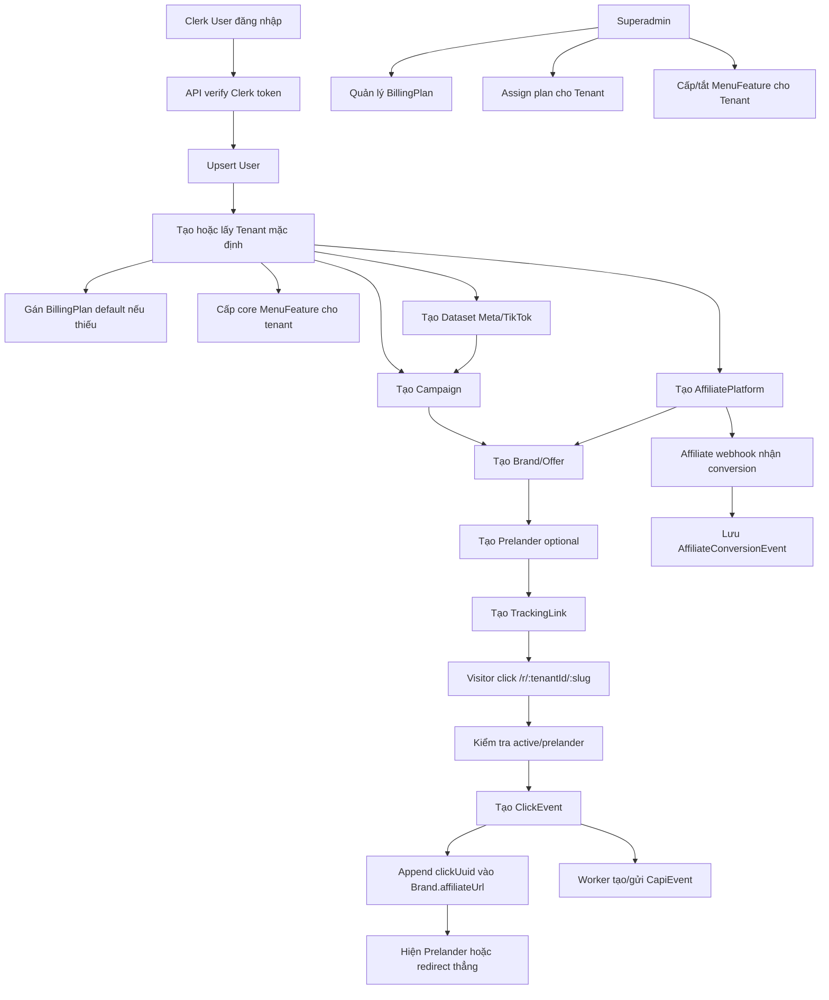
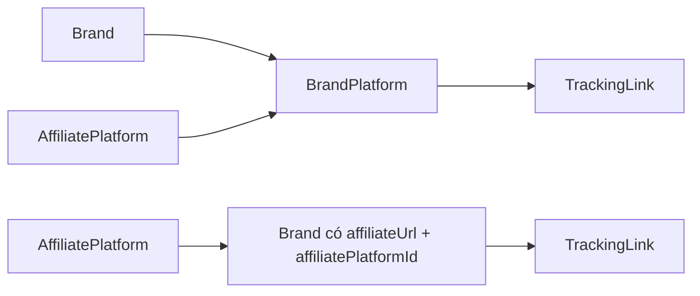

# Database Context

Tài liệu này mô tả database hiện tại của Tracking SaaS Starter theo schema Prisma trong `packages/db/prisma/schema.prisma`.

Mục tiêu đọc nhanh:

- Hiểu tenant/workspace là ranh giới dữ liệu.
- Hiểu luồng chính: `Campaign -> Brand/Offer -> TrackingLink -> ClickEvent -> CapiEvent`.
- Hiểu `AffiliatePlatform` chỉ là cấu hình network, còn affiliate URL nằm trực tiếp ở `Brand`.
- Hiểu `Dataset` là cấu hình pixel/access token dùng chung cho campaign và worker CAPI.
- Hiểu `Prelander` là bridge page/template thật, có thể gắn vào `TrackingLink`.
- Hiểu billing plan, quota tháng và menu/function grant theo tenant.

## Stack database

- Database: PostgreSQL.
- ORM: Prisma Client.
- Auth source: Clerk.
- Mô hình tenant hiện tại: **mỗi Clerk user có một tenant/workspace mặc định**.
- Mọi bảng nghiệp vụ chính đều có `tenantId` để scope theo workspace.
- Superadmin không nằm trong DB role riêng; quyền superadmin hiện lấy từ env `SUPERADMIN_EMAILS` / `SUPERADMIN_CLERK_USER_IDS`.

## Sơ đồ ERD tổng quan

```mermaid
erDiagram
  User ||--|| Tenant : owns
  BillingPlan ||--o{ Tenant : assigned_to

  Tenant ||--o{ Campaign : has
  Tenant ||--o{ Brand : has
  Tenant ||--o{ AffiliatePlatform : has
  Tenant ||--o{ Dataset : has
  Tenant ||--o{ Prelander : has
  Tenant ||--o{ TrackingLink : has
  Tenant ||--o{ ClickEvent : has
  Tenant ||--o{ AffiliateConversionEvent : has
  Tenant ||--o{ CapiEvent : has
  Tenant ||--o{ TenantMenuGrant : receives

  MenuFeature ||--o{ TenantMenuGrant : granted_by

  Dataset ||--o{ Campaign : selected_by
  Campaign ||--o{ Brand : contains
  Campaign ||--o{ TrackingLink : groups
  Campaign ||--o{ ClickEvent : receives

  AffiliatePlatform ||--o{ Brand : used_by
  AffiliatePlatform ||--o{ AffiliateConversionEvent : receives

  Brand ||--o{ TrackingLink : promoted_by
  Prelander ||--o{ TrackingLink : used_by
  TrackingLink ||--o{ ClickEvent : captures
  ClickEvent ||--o{ CapiEvent : produces

  User {
    string id PK
    string clerkUserId UK
    string email
    string firstName
    string lastName
    string imageUrl
    datetime createdAt
    datetime updatedAt
  }

  Tenant {
    string id PK
    string ownerUserId UK
    string billingPlanId FK_nullable
    string slug UK
    string name
    string clickWebhookToken
    datetime createdAt
    datetime updatedAt
  }

  BillingPlan {
    string id PK
    string slug UK
    string name
    string description
    int monthlyPriceCents
    string currency
    int clickLimit
    int capiEventLimit
    int eapiEventLimit
    boolean isDefault
    boolean isActive
    datetime createdAt
    datetime updatedAt
  }

  MenuFeature {
    string id PK
    string key UK
    string path UK
    string label
    string group
    string icon
    string badge
    string description
    int sortOrder
    boolean isCore
    boolean isActive
    datetime createdAt
    datetime updatedAt
  }

  TenantMenuGrant {
    string id PK
    string tenantId FK
    string menuFeatureId FK
    boolean isEnabled
    datetime createdAt
    datetime updatedAt
  }

  Campaign {
    string id PK
    string tenantId FK
    string name
    string datasetId FK_nullable
    datetime createdAt
    datetime updatedAt
  }

  Dataset {
    string id PK
    string tenantId FK
    string platform
    string name
    string pixelId
    string accessToken
    boolean isActive
    datetime createdAt
    datetime updatedAt
  }

  AffiliatePlatform {
    string id PK
    string tenantId FK
    string name
    string slug
    string trackingParamKey
    string webhookMethod
    string webhookToken
    datetime createdAt
    datetime updatedAt
  }

  Brand {
    string id PK
    string tenantId FK
    string campaignId FK
    string affiliatePlatformId FK
    string name
    string affiliateUrl
    datetime createdAt
    datetime updatedAt
  }

  Prelander {
    string id PK
    string tenantId FK
    string name
    string headline
    string body
    string ctaText
    int ctaDelaySeconds
    string theme
    boolean isActive
    datetime createdAt
    datetime updatedAt
  }

  TrackingLink {
    string id PK
    string tenantId FK
    string campaignId FK
    string brandId FK
    string prelanderId FK_nullable
    string slug
    boolean prelanderEnabled
    boolean isActive
    datetime createdAt
    datetime updatedAt
  }

  ClickEvent {
    bigint id PK
    string tenantId FK
    string campaignId FK
    string trackingLinkId FK
    string clickUuid UK
    string ip
    string userAgent
    string referrer
    string fbp
    string fbc
    string ttp
    string ttclid
    string fbclid
    json metadata
    datetime createdAt
  }

  AffiliateConversionEvent {
    bigint id PK
    string tenantId FK
    string affiliatePlatformId FK
    string clickUuid
    string customerId
    string customerEmail
    decimal spendAmount
    decimal payoutAmount
    decimal commissionAmount
    string currency
    json rawPayload
    string receivedMethod
    datetime createdAt
  }

  CapiEvent {
    bigint id PK
    string tenantId FK
    bigint clickEventId FK
    string platform
    string eventName
    json payload
    EventDeliveryStatus status
    int attempts
    string lastError
    datetime createdAt
    datetime updatedAt
  }
```

## Luồng dữ liệu chính



## Nguyên tắc tenant và phân quyền

- `Tenant` là workspace.
- `Tenant.ownerUserId` là user sở hữu workspace.
- API quản lý luôn lấy Clerk token, sync thành `User`, rồi query dữ liệu qua `tenant.ownerUserId`.
- Khi create/update/delete entity, API kiểm tra tenant có thuộc user hiện tại không.
- Hiện tại product context là **mỗi user một tenant**. Nếu sau này làm multi-member workspace thì cần thêm bảng membership/role.
- Superadmin hiện được xác định bằng env, không phải bằng bảng permission trong DB.
- Menu/function của user thường được điều khiển bằng `MenuFeature` + `TenantMenuGrant`.
- Superadmin thấy toàn bộ menu ở frontend, không phụ thuộc `TenantMenuGrant`.

## Billing và quota tháng

Billing hiện là internal plan/level, chưa phải subscription payment provider đầy đủ.

- Mỗi tenant có thể gắn một `BillingPlan` qua `Tenant.billingPlanId`.
- Nếu tenant chưa có plan, API sẽ lấy hoặc tạo default free plan.
- Default free plan hiện có slug `free`, giới hạn mặc định:
  - `clickLimit`: 1000 click/tháng.
  - `capiEventLimit`: 1000 CAPI event/tháng.
  - `eapiEventLimit`: 1000 EAPI/affiliate webhook event/tháng.
- Quota được tính từ đầu tháng UTC:
  - Click: count `ClickEvent` từ đầu tháng.
  - CAPI: count `CapiEvent` từ đầu tháng.
  - EAPI: count `AffiliateConversionEvent` từ đầu tháng.

Điểm enforce quota:

- Custom click webhook API theo từng tracking link kiểm tra `clickLimit` trước khi tạo `ClickEvent`.
- Affiliate webhook API kiểm tra `eapiEventLimit` trước khi tạo `AffiliateConversionEvent`.
- Worker kiểm tra `capiEventLimit` trước khi tạo/upsert `CapiEvent`.

Lưu ý: redirect service public `/r/:tenantId/:slug` hiện tạo click trực tiếp trong redirect app. Nếu cần quota click áp dụng cả redirect click, cần đảm bảo redirect service cũng gọi cùng logic quota hoặc đi qua API click webhook.

## Dynamic menu/function grant

Menu không còn là danh sách cố định cho mọi tenant.

- `MenuFeature` lưu danh mục menu/chức năng có thể cấp.
- `TenantMenuGrant` lưu tenant nào được bật feature nào.
- Core features được tự động cấp khi tenant được tạo hoặc khi user gọi API.
- Superadmin có API quản lý menu grants theo tenant.
- Frontend lọc sidebar theo `Tenant.menuGrants`.
- Frontend route cũng được bọc `FeatureGate` để chặn truy cập trực tiếp bằng URL nếu tenant chưa được cấp feature.

Danh sách feature seed hiện tại:

| Key | Path | Nhóm | Core | Ghi chú |
| --- | --- | --- | --- | --- |
| `dashboard` | `/dashboard` | Workspace | Có | Overview chính. |
| `campaigns` | `/campaigns` | Workspace | Có | Campaign CRUD. |
| `brands` | `/brands` | Workspace | Có | Brand/Offer CRUD. |
| `platforms` | `/platforms` | Workspace | Có | Affiliate platform CRUD. |
| `datasets` | `/datasets` | Workspace | Có | Meta/TikTok dataset CRUD. |
| `prelanders` | `/prelanders` | Tracking | Có | Bridge page/prelander CRUD. |
| `tracking-links` | `/tracking-links` | Tracking | Có | Shortlink CRUD. |
| `click-events` | `/click-events` | Tracking | Có | Click log. |
| `analytics` | `/analytics` | Tracking | Không | Summary clicks/conversions/CAPI, có thể bị khóa theo grant. |
| `billing` | `/billing` | Account | Có | Hiện là placeholder user-side, superadmin quản lý plan. |
| `settings` | `/settings` | Account | Có | Placeholder. |
| `support` | `/support` | Account | Có | Placeholder. |
| `superadmin` | `/superadmin` | Admin | Không | Chỉ superadmin nên thấy/truy cập. |

## Bảng User

Đồng bộ user nội bộ từ Clerk.

| Field | Ý nghĩa |
| --- | --- |
| `id` | UUID nội bộ. |
| `clerkUserId` | ID user từ Clerk, unique. |
| `email` | Email chính. |
| `firstName`, `lastName` | Tên từ Clerk. |
| `imageUrl` | Avatar từ Clerk. |
| `createdAt`, `updatedAt` | Audit timestamps. |

Quan hệ:

- `User 1-1 Tenant`.

## Bảng Tenant

Workspace chứa toàn bộ dữ liệu tracking của một user.

| Field | Ý nghĩa |
| --- | --- |
| `id` | UUID workspace. |
| `ownerUserId` | User sở hữu tenant, unique. |
| `billingPlanId` | Billing plan hiện tại của tenant, nullable. |
| `slug` | Slug workspace, unique toàn hệ thống. |
| `name` | Tên workspace. |
| `clickWebhookToken` | Token riêng cho custom click webhook. |
| `createdAt`, `updatedAt` | Audit timestamps. |

Quan hệ chính:

- Thuộc một `User` qua `ownerUserId`.
- Có thể thuộc một `BillingPlan` qua `billingPlanId`.
- Có nhiều `Campaign`, `Brand`, `AffiliatePlatform`, `Dataset`, `Prelander`, `TrackingLink`, `ClickEvent`, `AffiliateConversionEvent`, `CapiEvent`, `TenantMenuGrant`.

Index:

- `@@index([ownerUserId])`
- `@@index([billingPlanId])`
- `@@index([createdAt])`

## Bảng BillingPlan

Định nghĩa level/gói tài khoản nội bộ và quota tháng.

| Field | Ý nghĩa |
| --- | --- |
| `id` | UUID billing plan. |
| `slug` | Slug unique, ví dụ `free`, `pro`, `scale`. |
| `name` | Tên gói hiển thị. |
| `description` | Mô tả gói, nullable. |
| `monthlyPriceCents` | Giá tháng theo đơn vị cents. |
| `currency` | Tiền tệ, mặc định `USD`. |
| `clickLimit` | Số click data được lưu mỗi tháng. |
| `capiEventLimit` | Số CAPI event được tạo/gửi mỗi tháng. |
| `eapiEventLimit` | Số affiliate/EAPI webhook event mỗi tháng. |
| `isDefault` | Có phải gói mặc định không. |
| `isActive` | Gói còn active không. |
| `createdAt`, `updatedAt` | Audit timestamps. |

Quan hệ:

- Một `BillingPlan` có nhiều `Tenant`.

Index:

- `@@index([isDefault])`
- `@@index([isActive])`

## Bảng MenuFeature

Danh mục menu/chức năng có thể cấp cho tenant.

| Field | Ý nghĩa |
| --- | --- |
| `id` | UUID feature. |
| `key` | Key unique dùng trong frontend/router, ví dụ `campaigns`. |
| `path` | Route path unique, ví dụ `/campaigns`. |
| `label` | Tên hiển thị trên menu. |
| `group` | Nhóm menu. |
| `icon` | Tên icon frontend. |
| `badge` | Badge optional. |
| `description` | Mô tả optional. |
| `sortOrder` | Thứ tự hiển thị. |
| `isCore` | Feature core được cấp mặc định cho tenant. |
| `isActive` | Feature còn hoạt động không. |
| `createdAt`, `updatedAt` | Audit timestamps. |

Quan hệ:

- Một `MenuFeature` có nhiều `TenantMenuGrant`.

Index:

- `@@index([group])`
- `@@index([isActive])`
- `@@index([sortOrder])`

## Bảng TenantMenuGrant

Bảng nối tenant với menu/function được cấp.

| Field | Ý nghĩa |
| --- | --- |
| `id` | UUID grant. |
| `tenantId` | Tenant được cấp feature. |
| `menuFeatureId` | Feature được cấp. |
| `isEnabled` | Feature có đang bật cho tenant không. |
| `createdAt`, `updatedAt` | Audit timestamps. |

Quan hệ:

- Thuộc `Tenant`.
- Thuộc `MenuFeature`.

Constraints/indexes:

- `@@unique([tenantId, menuFeatureId])`
- `@@index([tenantId])`
- `@@index([menuFeatureId])`
- `@@index([isEnabled])`

## Bảng Dataset

Dataset là cấu hình pixel/access token dùng chung cho Meta/TikTok. Campaign có thể chọn một dataset.

| Field | Ý nghĩa |
| --- | --- |
| `id` | UUID dataset. |
| `tenantId` | Workspace sở hữu. |
| `platform` | `meta`, `tiktok`, hoặc platform mở rộng sau này. |
| `name` | Tên dễ nhớ. |
| `pixelId` | Pixel/Dataset ID của ad platform. |
| `accessToken` | Token dùng cho CAPI. |
| `isActive` | Bật/tắt dataset. |
| `createdAt`, `updatedAt` | Audit timestamps. |

Constraints/indexes:

- `@@index([tenantId])`
- `@@index([platform])`
- `@@index([isActive])`
- `@@unique([tenantId, name])`
- `@@unique([tenantId, platform, pixelId])`

## Bảng Campaign

Campaign gom nhóm offer/link/click theo chiến dịch marketing.

| Field | Ý nghĩa |
| --- | --- |
| `id` | UUID campaign. |
| `tenantId` | Workspace sở hữu. |
| `name` | Tên campaign. |
| `datasetId` | Dataset được chọn, nullable. Nếu dataset bị xóa thì set null. |
| `createdAt`, `updatedAt` | Audit timestamps. |

Quan hệ:

- Thuộc `Tenant`.
- Có thể chọn một `Dataset`.
- Có nhiều `Brand`.
- Có nhiều `TrackingLink`.
- Có nhiều `ClickEvent`.

Constraints/indexes:

- `@@index([tenantId])`
- `@@index([datasetId])`
- `@@unique([tenantId, name])`

## Bảng AffiliatePlatform

AffiliatePlatform là cấu hình network/platform affiliate dùng chung trong workspace. Nó **không phải offer** và **không lưu affiliate URL cụ thể**.

Ví dụ: Impact, PartnerStack, FirstPromoter, CJ, Rakuten, custom network.

| Field | Ý nghĩa |
| --- | --- |
| `id` | UUID platform. |
| `tenantId` | Workspace sở hữu. |
| `name` | Tên network. |
| `slug` | Slug dùng trong webhook URL. |
| `trackingParamKey` | Param để truyền `clickUuid`, ví dụ `subid1`, `sid1`, `fp_sid`. |
| `webhookMethod` | Method conversion webhook: `GET` hoặc `POST`. |
| `webhookToken` | Token bí mật tự sinh. |
| `createdAt`, `updatedAt` | Audit timestamps. |

Constraints/indexes:

- `@@index([tenantId])`
- `@@unique([tenantId, slug])`
- `@@unique([tenantId, name])`

Webhook URL dạng hiện tại:

```txt
/affiliate-webhooks/:tenantId/:platformSlug?token=:webhookToken
```

## Bảng Brand

Brand đại diện cho brand/offer cụ thể trong campaign. Đây là nơi lưu affiliate URL của offer.

| Field | Ý nghĩa |
| --- | --- |
| `id` | UUID brand/offer. |
| `tenantId` | Workspace sở hữu. |
| `campaignId` | Campaign chứa offer. |
| `affiliatePlatformId` | Network/platform affiliate được chọn. |
| `name` | Tên brand/offer. |
| `affiliateUrl` | Affiliate URL đích của offer. |
| `createdAt`, `updatedAt` | Audit timestamps. |

Quan hệ:

- Thuộc `Tenant`.
- Thuộc `Campaign`.
- Thuộc `AffiliatePlatform`.
- Có nhiều `TrackingLink`.

Constraints/indexes:

- `@@index([tenantId])`
- `@@index([campaignId])`
- `@@index([affiliatePlatformId])`
- `@@unique([campaignId, name])`

Ghi nhớ quan trọng:

- Không còn luồng cơ bản kiểu `BrandPlatform` trung gian.
- User tạo Brand/Offer thì chọn AffiliatePlatform và nhập affiliate URL ngay.
- TrackingLink lấy URL đích từ `Brand.affiliateUrl`.
- TrackingLink lấy param key từ `Brand.affiliatePlatform.trackingParamKey`.

## Bảng Prelander

Prelander là bridge page/template đơn giản hiển thị trước khi chuyển visitor sang affiliate URL. TrackingLink có thể chọn một prelander cụ thể hoặc để trống.

| Field | Ý nghĩa |
| --- | --- |
| `id` | UUID prelander. |
| `tenantId` | Workspace sở hữu. |
| `name` | Tên nội bộ, unique trong tenant. |
| `headline` | Tiêu đề hiển thị trên bridge page. |
| `body` | Nội dung/mô tả hiển thị, hỗ trợ xuống dòng ở HTML render. |
| `ctaText` | Text nút CTA, mặc định `Continue`. |
| `ctaDelaySeconds` | Số giây auto-redirect, mặc định `2`. |
| `theme` | Theme render hiện có: `clean`, `dark`, `warm`. |
| `isActive` | Bật/tắt prelander. TrackingLink có prelander inactive sẽ redirect thẳng. |
| `createdAt`, `updatedAt` | Audit timestamps. |

Quan hệ:

- Thuộc `Tenant`.
- Có nhiều `TrackingLink`.

Constraints/indexes:

- `@@index([tenantId])`
- `@@index([isActive])`
- `@@unique([tenantId, name])`

## Bảng TrackingLink

TrackingLink là shortlink public để capture click và redirect sang affiliate URL.

| Field | Ý nghĩa |
| --- | --- |
| `id` | UUID tracking link. |
| `tenantId` | Workspace sở hữu. |
| `campaignId` | Campaign liên quan. API tự lấy từ Brand khi tạo link. |
| `brandId` | Brand/Offer được quảng bá. |
| `prelanderId` | Prelander/template được chọn, nullable. Nếu prelander bị xóa thì set null. |
| `slug` | Slug public trong tenant. |
| `prelanderEnabled` | Bật/tắt prelander cho link. Nếu false thì redirect thẳng. |
| `isActive` | Bật/tắt link. |
| `createdAt`, `updatedAt` | Audit timestamps. |

Constraints/indexes:

- `@@index([tenantId])`
- `@@index([campaignId])`
- `@@index([brandId])`
- `@@index([prelanderId])`
- `@@index([isActive])`
- `@@unique([tenantId, slug])`

Public shortlink dạng:

```txt
/r/:tenantId/:slug
```

Luồng redirect:

1. Tìm `TrackingLink` bằng `tenantId + slug`.
2. Check `isActive`.
3. Load `Brand`, `AffiliatePlatform` và `Prelander` nếu có.
4. Tạo `ClickEvent` với `clickUuid`.
5. Add job `click.created` vào BullMQ.
6. Append `clickUuid` vào `Brand.affiliateUrl` bằng key `AffiliatePlatform.trackingParamKey`.
7. Nếu `prelanderEnabled = false` hoặc không có prelander active thì redirect thẳng.
8. Nếu có prelander active thì render HTML bridge page theo `Prelander` rồi auto-redirect sang offer.

## Bảng ClickEvent

ClickEvent là log append-only cho từng click.

| Field | Ý nghĩa |
| --- | --- |
| `id` | BigInt tự tăng. |
| `tenantId` | Workspace sở hữu. |
| `campaignId` | Campaign của link. |
| `trackingLinkId` | Link được click. |
| `clickUuid` | UUID duy nhất để attribution. |
| `ip` | IP visitor. |
| `userAgent` | User agent. |
| `referrer` | Referrer. |
| `fbp`, `fbc` | Facebook browser/click identifiers. |
| `ttp`, `ttclid` | TikTok identifiers. |
| `fbclid` | Facebook click id từ query. |
| `metadata` | JSON bổ sung. |
| `createdAt` | Thời điểm click. |

Indexes:

- `@@index([tenantId, createdAt])`
- `@@index([campaignId, createdAt])`
- `@@index([trackingLinkId, createdAt])`

Vai trò:

- Là nguồn dữ liệu cho analytics.
- Là nguồn để worker tạo/gửi CAPI event.
- Là điểm nối attribution với conversion thông qua `clickUuid`.
- Là metric dùng để tính quota `BillingPlan.clickLimit`.

## Bảng AffiliateConversionEvent

Lưu conversion/postback nhận từ affiliate network. Trong product context, phần này cũng được gọi là EAPI/affiliate webhook event.

| Field | Ý nghĩa |
| --- | --- |
| `id` | BigInt tự tăng. |
| `tenantId` | Workspace sở hữu. |
| `affiliatePlatformId` | Platform/network gửi conversion. |
| `clickUuid` | Click UUID nếu payload có. |
| `customerId`, `customerEmail` | Thông tin customer nếu network gửi. |
| `spendAmount` | Spend/revenue amount nếu có. |
| `payoutAmount` | Payout nếu có. |
| `commissionAmount` | Commission nếu có. |
| `currency` | Tiền tệ. |
| `rawPayload` | Payload gốc. |
| `receivedMethod` | GET/POST. |
| `createdAt` | Thời điểm nhận conversion. |

Indexes:

- `@@index([tenantId, createdAt])`
- `@@index([affiliatePlatformId, createdAt])`
- `@@index([clickUuid])`

Attribution hiện tại:

- Conversion lưu `clickUuid`.
- Analytics/attribution sau này sẽ join về `ClickEvent.clickUuid`.
- Là metric dùng để tính quota `BillingPlan.eapiEventLimit`.

## Bảng CapiEvent

CapiEvent là bản ghi event gửi hoặc chuẩn bị gửi tới Conversion API như Meta/TikTok.

| Field | Ý nghĩa |
| --- | --- |
| `id` | BigInt tự tăng. |
| `tenantId` | Workspace sở hữu. |
| `clickEventId` | Click nguồn. |
| `platform` | Nền tảng nhận event. |
| `eventName` | Tên event. |
| `payload` | Payload JSON. |
| `status` | `PENDING`, `PROCESSING`, `DELIVERED`, `FAILED`. |
| `attempts` | Số lần thử. |
| `lastError` | Lỗi gần nhất. |
| `createdAt`, `updatedAt` | Audit timestamps. |

Constraints/indexes:

- `@@index([tenantId, createdAt])`
- `@@index([status, createdAt])`
- `@@unique([clickEventId, platform, eventName])`

Vai trò:

- Là queue/outbox record cho CAPI delivery.
- Worker tạo/upsert record theo click, platform và event name.
- Payload sau khi xử lý lưu cả request/response/dryRun để debug delivery.
- Tránh tạo trùng event nhờ unique `[clickEventId, platform, eventName]`.
- Là metric dùng để tính quota `BillingPlan.capiEventLimit`.

## EventDeliveryStatus enum

| Value | Ý nghĩa |
| --- | --- |
| `PENDING` | Event mới tạo, chưa xử lý xong. |
| `PROCESSING` | Đang xử lý/gửi. |
| `DELIVERED` | Đã gửi thành công. |
| `FAILED` | Gửi/thực thi thất bại. |

## Delete behavior cần nhớ

Theo relation Prisma hiện tại:

- Xóa `User` sẽ cascade `Tenant` do `Tenant.ownerUserId` onDelete Cascade.
- Xóa `Tenant` sẽ cascade hầu hết dữ liệu con: `Campaign`, `Brand`, `AffiliatePlatform`, `Dataset`, `Prelander`, `TrackingLink`, `ClickEvent`, `AffiliateConversionEvent`, `CapiEvent`, `TenantMenuGrant`.
- Xóa `BillingPlan` sẽ set `Tenant.billingPlanId = null`.
- Xóa `MenuFeature` sẽ cascade `TenantMenuGrant` liên quan.
- Xóa `Campaign` sẽ cascade `Brand`, `TrackingLink`, `ClickEvent` liên quan.
- Xóa `Brand` sẽ cascade `TrackingLink` liên quan.
- Xóa `TrackingLink` sẽ cascade `ClickEvent` liên quan.
- Xóa `Dataset` sẽ set `Campaign.datasetId = null`.
- Xóa `Prelander` sẽ set `TrackingLink.prelanderId = null`.
- Xóa `AffiliatePlatform` sẽ cascade `Brand` và conversion liên quan.
- Xóa `ClickEvent` sẽ cascade `CapiEvent` liên quan.

Vì cascade khá mạnh, UI đã dùng confirm trước khi xóa các entity chính.

## Unique constraints quan trọng

| Model | Constraint | Ý nghĩa |
| --- | --- | --- |
| `User` | `clerkUserId` unique | Một Clerk user chỉ map một user nội bộ. |
| `Tenant` | `ownerUserId` unique | Hiện tại một user chỉ có một tenant. |
| `Tenant` | `slug` unique | Slug workspace unique toàn hệ thống. |
| `BillingPlan` | `slug` unique | Không trùng slug gói. |
| `MenuFeature` | `key` unique | Không trùng feature key. |
| `MenuFeature` | `path` unique | Không trùng route path. |
| `TenantMenuGrant` | `[tenantId, menuFeatureId]` unique | Một feature chỉ có một grant record trên mỗi tenant. |
| `Campaign` | `[tenantId, name]` unique | Không trùng tên campaign trong workspace. |
| `Dataset` | `[tenantId, name]` unique | Không trùng tên dataset trong workspace. |
| `Dataset` | `[tenantId, platform, pixelId]` unique | Không trùng pixel cùng platform. |
| `AffiliatePlatform` | `[tenantId, slug]` unique | Webhook slug không trùng trong workspace. |
| `AffiliatePlatform` | `[tenantId, name]` unique | Không trùng tên network trong workspace. |
| `Brand` | `[campaignId, name]` unique | Không trùng brand/offer trong campaign. |
| `Prelander` | `[tenantId, name]` unique | Không trùng tên prelander trong workspace. |
| `TrackingLink` | `[tenantId, slug]` unique | Shortlink không trùng trong workspace. |
| `ClickEvent` | `clickUuid` unique | Click UUID duy nhất để attribution. |
| `CapiEvent` | `[clickEventId, platform, eventName]` unique | Tránh tạo trùng CAPI event cho cùng click/platform/event. |

## Migration hiện tại

Các migration quan trọng gần đây:

- `20260521030700_billing_plans`
  - Tạo bảng `BillingPlan`.
  - Thêm `Tenant.billingPlanId`.
  - Seed default free plan.
  - Gán existing tenants vào free plan.
- `20260521032600_tenant_menu_features`
  - Tạo bảng `MenuFeature`.
  - Tạo bảng `TenantMenuGrant`.
  - Seed menu features mặc định.
  - Grant core features cho existing tenants.
- `20260521050300_prelanders_capi_delivery`
  - Tạo bảng `Prelander`.
  - Thêm `TrackingLink.prelanderId` và quan hệ onDelete SetNull.
  - Seed menu feature core `prelanders` và grant cho existing tenants.
  - Cập nhật worker CAPI theo luồng delivery thật/dry-run.

Trạng thái gần nhất đã kiểm tra:

```txt
14 migrations found in prisma/migrations
Database schema is up to date!
```

## Ghi chú lịch sử schema

Luồng cũ từng có khái niệm `BrandPlatform` và `brandPlatformId` trên `TrackingLink`. Luồng hiện tại đã đơn giản hóa:



Lý do đổi:

- Mỗi Brand/Offer trong luồng cơ bản chỉ cần một affiliate URL chính.
- User tạo offer nhanh hơn: chọn network và nhập link ngay trong Brand.
- TrackingLink chỉ cần trỏ tới Brand/Offer.

Nếu sau này cần một offer chạy nhiều network song song, có thể thiết kế lại bảng mở rộng tương tự `BrandPlatform`, nhưng không phải luồng mặc định hiện tại.

## Các bảng/chức năng chưa có trong DB

Các mục roadmap chưa có model riêng trong schema hiện tại:

- Team members / membership / role.
- Custom domains / DNS verification.
- Attribution result table hoặc conversion-to-click materialized result.
- ClickHouse mirror/warehouse tables.
- AI optimization/routing rules.
- Payment subscription/customer/invoice records từ Stripe/Paddle.
