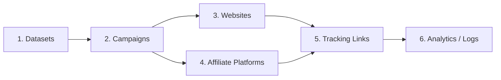

# Hướng Dẫn Các Thành Phần Trong Aff Track Pro

Tài liệu này giải thích các mục chính trong app theo góc nhìn người sử dụng. Mục tiêu là giúp bạn hiểu nên tạo gì trước, mỗi mục dùng để làm gì, và chúng liên kết với nhau như thế nào khi chạy affiliate tracking.

## Luồng Setup Khuyến Nghị

Thứ tự dễ dùng nhất:

1. Tạo `Datasets` cho Meta hoặc TikTok.
2. Tạo `Campaigns` và gắn dataset vào campaign.
3. Thêm `Websites` nếu bạn có landing page/website riêng cần gắn mã tracking.
4. Tạo `Affiliate Platforms` để nhận conversion/postback từ sàn affiliate.
5. Tạo `Tracking Links` để chạy traffic.
6. Kiểm tra kết quả trong `Analytics`, `Activity Logs`, `Click Events`, `CAPI Events`.

## Campaigns

### Campaign Là Gì?

`Campaign` là chiến dịch dùng để gom nhóm tracking links và chọn bộ dataset sẽ nhận event.

Nói đơn giản: campaign trả lời câu hỏi **traffic/link này thuộc chiến dịch nào và sẽ gửi event về pixel nào?**

Ví dụ campaign:

- `Impact - Offer A - US`
- `TikTok - SaaS Trial - VN`
- `PartnerStack - CRM - Retargeting`

### Khi Nào Cần Tạo Campaign?

Bạn nên tạo campaign khi:

- chạy một offer, sản phẩm hoặc nhóm traffic riêng;
- muốn xem hiệu quả theo từng chiến dịch;
- muốn gắn một hoặc nhiều dataset Meta/TikTok cho cùng nhóm tracking links;
- muốn sau này lọc analytics theo campaign.

### Campaign Liên Kết Với Gì?

Campaign liên kết với:

- `Datasets`: để biết event sẽ gửi về pixel nào.
- `Tracking Links`: mỗi link có thể chọn một campaign.
- `Analytics`: click, conversion và revenue có thể được xem theo campaign.

### Cách Dùng Trong App

1. Vào `Campaigns`.
2. Bấm `Thêm campaign`.
3. Đặt tên campaign dễ nhận biết.
4. Mở chi tiết campaign.
5. Chọn các dataset cần dùng.
6. Bấm lưu dataset.

### Lưu Ý

- Campaign không phải nơi nhập affiliate URL.
- Affiliate URL được nhập trong `Tracking Links`.
- Nếu tracking link không chọn campaign hoặc campaign chưa gắn dataset, hệ thống có thể vẫn ghi nhận click nhưng không có dataset để gửi CAPI.
- Nên đặt tên campaign theo offer, nguồn traffic, quốc gia hoặc mục tiêu chạy.

## Datasets

### Dataset Là Gì?

`Dataset` là cấu hình pixel của Meta hoặc TikTok mà hệ thống sẽ gửi event về.

Trong app này, dataset không phải file dữ liệu. Dataset là nơi bạn khai báo:

- nền tảng: Meta hoặc TikTok;
- Pixel ID/Dataset ID;
- Access Token;
- trạng thái active/inactive.

Ví dụ dataset:

- `Meta Pixel - US Main`
- `TikTok Pixel - VN Landing`
- `Meta Pixel - Retargeting`

### Khi Nào Cần Tạo Dataset?

Bạn cần tạo dataset trước khi muốn gửi event về Meta/TikTok.

Tạo dataset khi:

- muốn gửi click/conversion về Meta CAPI;
- muốn gửi event về TikTok Events API;
- có nhiều pixel cho nhiều thị trường, offer hoặc tài khoản quảng cáo;
- muốn một campaign gửi event về nhiều pixel cùng lúc.

### Dataset Liên Kết Với Gì?

Dataset liên kết với:

- `Campaigns`: campaign chọn dataset nào thì event của tracking link trong campaign đó sẽ gửi về dataset đó.
- `Tracking Links`: link chọn campaign, campaign chọn dataset.
- `CAPI Events`: mỗi lần hệ thống gửi event về Meta/TikTok sẽ tạo một bản ghi theo dataset.

### Cách Dùng Trong App

1. Vào `Datasets`.
2. Bấm `Thêm dataset`.
3. Chọn `Meta` hoặc `TikTok`.
4. Nhập tên dataset.
5. Nhập Pixel ID/Dataset ID.
6. Nhập Access Token.
7. Lưu lại.
8. Vào campaign để gắn dataset đó vào chiến dịch cần chạy.

### Lưu Ý

- Dataset phải được gắn vào campaign thì mới được dùng khi gửi event.
- Nếu dataset bị inactive, hệ thống sẽ không gửi event về dataset đó.
- Một campaign có thể chọn nhiều dataset, tùy giới hạn gói tài khoản.
- Nên đặt tên dataset rõ platform và mục đích sử dụng.

## Data Sources

`Data Sources` là nhóm các nguồn dữ liệu đầu vào của hệ thống.

Trong app hiện tại có hai loại chính:

- `Websites`: nguồn click đến từ website hoặc landing page của bạn.
- `Affiliate Platforms`: nguồn conversion/postback đến từ sàn affiliate.

Hai nguồn này phục vụ hai phần khác nhau của tracking:

- Website giúp hệ thống biết user đã click affiliate link trên landing page.
- Affiliate Platform giúp hệ thống biết conversion/purchase đã xảy ra ở sàn affiliate.

## Websites

### Website Là Gì?

`Websites` là nơi bạn lấy mã tracking và khai báo domain được phép dùng mã đó.

Nếu bạn có landing page riêng, bạn dán mã tracking của Aff Track Pro vào website. Sau đó script sẽ quét các affiliate URL hoặc shortlink trên trang và ghi nhận click khi người dùng bấm thật.

### Khi Nào Cần Dùng Websites?

Dùng `Websites` khi:

- bạn có landing page/website riêng;
- trên website có nút hoặc link đi tới affiliate offer;
- bạn muốn tự động gắn click ID vào affiliate URL có sẵn trên trang;
- bạn muốn ghi nhận click ngay cả khi user không đi qua shortlink trước.

Nếu bạn chỉ chạy traffic trực tiếp vào tracking shortlink của app, bạn có thể chưa cần dùng mục Websites.

### Websites Liên Kết Với Gì?

Websites liên kết với:

- `Tracking Links`: script quét các affiliate URL/shortlink thuộc tracking links đã tạo.
- `Click Events`: khi user click affiliate URL trên website, hệ thống ghi nhận click.
- `Datasets`: nếu link thuộc campaign có dataset, event có thể được gửi về Meta/TikTok.

### Cách Dùng Trong App

1. Vào `Websites`.
2. Copy mã tracking trong khối `Mã tracking`.
3. Dán mã này vào phần `<head>` của website/landing page.
4. Thêm domain website vào danh sách `Website domains`.
5. Lưu lại.
6. Mở website và thử click affiliate link để kiểm tra.

### Mã Tracking Hoạt Động Như Thế Nào?

Sau khi được dán vào website, mã tracking sẽ:

- quét link và form trên trang;
- phát hiện affiliate URL hoặc shortlink đã tạo trong app;
- tự gắn click ID vào affiliate URL;
- chỉ gửi dữ liệu khi người dùng click thật;
- thu thập một số thông tin phục vụ attribution như referrer, browser identifiers, click IDs từ ad platform.

### Lưu Ý

- Domain phải được thêm vào `Website domains`; nếu không, mã tracking sẽ bị chặn.
- Có thể nhập domain dạng `example.com` hoặc URL đầy đủ như `https://landing.example.com`.
- Nên kiểm tra `Activity Logs` hoặc `Click Events` sau khi test click.
- Nếu website thay đổi nội dung động, script vẫn có thể quét lại các link mới được thêm vào trang.

## Affiliate Platforms

### Affiliate Platform Là Gì?

`Affiliate Platform` là sàn hoặc network affiliate bạn dùng để nhận conversion/postback.

Ví dụ:

- Impact
- PartnerStack
- FirstPromoter

Nói đơn giản: affiliate platform trả lời câu hỏi **conversion từ sàn nào gửi về và sàn đó dùng tham số nào để nhận click ID?**

### Khi Nào Cần Tạo Affiliate Platform?

Bạn cần tạo affiliate platform khi:

- muốn nhận postback/conversion từ sàn affiliate;
- muốn hệ thống match conversion với click đã ghi nhận;
- muốn gửi conversion như Purchase, Payout hoặc CompleteRegistration về Meta/TikTok;
- đang chạy nhiều network affiliate khác nhau và cần tách dữ liệu theo network.

### Affiliate Platform Liên Kết Với Gì?

Affiliate Platform liên kết với:

- `Tracking Links`: mỗi tracking link chọn một affiliate platform.
- `Affiliate URL`: hệ thống dùng platform để biết nên gắn click ID vào tham số nào.
- `Conversion Events`: postback từ sàn được ghi nhận theo platform.
- `Analytics`: có thể xem hiệu quả theo platform.

### Cách Dùng Trong App

1. Vào `Affiliate Platforms`.
2. Bấm `Thêm platform`.
3. Chọn nền tảng affiliate đang dùng.
4. Đặt tên dễ nhận biết, ví dụ `Impact - Main Account`.
5. Lưu lại.
6. Mở chi tiết hoặc danh sách platform để copy webhook URL.
7. Dán webhook URL đó vào phần postback/webhook trong tài khoản affiliate network.

### Webhook/Postback Là Gì?

Webhook/postback là URL để affiliate network gọi về Aff Track Pro khi có conversion.

Khi network gửi postback:

- hệ thống nhận conversion;
- tìm click tương ứng bằng click ID hoặc ref ID;
- lưu conversion vào analytics;
- nếu match được campaign có dataset, hệ thống có thể gửi event về Meta/TikTok.

### Lưu Ý

- Affiliate platform không phải offer.
- Offer/affiliate URL cụ thể được nhập trong `Tracking Links`.
- Mỗi network có cách đặt tên tracking parameter khác nhau, app sẽ tự xử lý theo platform đã chọn.
- Sau khi tạo platform, nên test webhook bằng một conversion test hoặc postback mẫu nếu network hỗ trợ.

## Tracking Links

### Tracking Link Là Gì?

`Tracking Link` là link public dùng để chạy traffic và chuyển người dùng sang affiliate URL.

Tracking link là thành phần quan trọng nhất khi chạy campaign, vì nó kết nối:

- campaign;
- affiliate platform;
- affiliate URL;
- slug shortlink;
- bridge page nếu có;
- trạng thái active/inactive.

Ví dụ:

- Slug: `crm-us`
- Affiliate URL: `https://affiliate-network.com/offer/123`
- Public link: `https://your-redirect-domain.com/crm-us/{workspace-key}`

### Khi Nào Cần Tạo Tracking Link?

Bạn cần tạo tracking link khi:

- chuẩn bị chạy quảng cáo hoặc gửi traffic tới offer;
- muốn ghi nhận click;
- muốn tự động gắn click ID vào affiliate URL;
- muốn match conversion từ affiliate network;
- muốn gửi event về Meta/TikTok thông qua campaign dataset.

### Tracking Link Liên Kết Với Gì?

Tracking link liên kết với:

- `Campaign`: để biết link thuộc chiến dịch nào và dùng dataset nào.
- `Affiliate Platform`: để biết click ID được gắn vào affiliate URL theo tham số nào.
- `Affiliate URL`: trang đích/offer thật trên affiliate network.
- `Bridge Page`: trang trung gian nếu bạn bật.
- `Click Events`: mỗi lượt click hợp lệ sẽ tạo dữ liệu click.
- `Conversion Events`: conversion từ network có thể match về click của tracking link.

### Cách Tạo Tracking Link

1. Vào `Tracking Links`.
2. Bấm `Thêm link`.
3. Chọn campaign nếu muốn link thuộc một chiến dịch cụ thể.
4. Chọn affiliate platform.
5. Nhập affiliate URL.
6. Nhập slug ngắn, dễ nhớ.
7. Bật bridge page nếu cần.
8. Lưu link.
9. Copy shortlink để chạy traffic hoặc gắn vào website.

### Khi User Click Tracking Link

Khi người dùng mở tracking link:

1. Hệ thống kiểm tra link có active không.
2. Hệ thống tạo click ID riêng cho lượt click đó.
3. Hệ thống lưu click event.
4. Hệ thống gắn click ID vào affiliate URL.
5. Nếu bật bridge page, user thấy trang trung gian trước.
6. Nếu không bật bridge page, user được chuyển thẳng sang affiliate URL.
7. Nếu campaign có dataset, hệ thống có thể gửi event về Meta/TikTok.

### Bridge Page Là Gì?

Bridge page là trang trung gian trước khi chuyển user sang affiliate URL.

Dùng bridge page khi bạn muốn:

- hiển thị thông điệp ngắn trước khi redirect;
- tăng thời gian để browser pixel hoạt động;
- tạo cảm giác chuyển hướng an toàn hơn;
- tùy chỉnh headline, body, CTA, delay và theme.

Các tùy chọn thường có:

- `Bridge title`
- `Headline`
- `Body`
- `CTA text`
- `Delay seconds`
- `Theme`

### Lưu Ý Về Slug

Slug là phần ngắn trong public shortlink.

Nên:

- đặt slug ngắn, rõ nghĩa;
- không đổi slug sau khi campaign đã chạy ổn định;
- tránh dùng slug trùng hoặc quá chung chung;
- đặt theo offer, market hoặc nguồn traffic.

Ví dụ tốt:

- `crm-us`
- `vpn-vn-tiktok`
- `saas-trial-impact`

## Click Events

`Click Events` là dữ liệu phát sinh khi người dùng click tracking link hoặc affiliate URL được script phát hiện trên website.

Bạn thường dùng Click Events để kiểm tra:

- click có được ghi nhận không;
- click đến từ tracking link nào;
- campaign nào đang có click;
- có `fbclid`, `ttclid`, referrer hay thông tin trình duyệt không;
- tracking script trên website có hoạt động không.

Click Events không phải mục cần tạo thủ công.

## Conversion Events

`Conversion Events` là dữ liệu conversion/postback gửi từ affiliate platform về app.

Bạn thường dùng Conversion Events để kiểm tra:

- network đã gửi postback về chưa;
- conversion có match được click không;
- event là Purchase, Payout hay CompleteRegistration;
- amount, payout, commission, currency có đúng không;
- conversion có bị duplicate không.

Conversion Events không phải mục cần tạo thủ công.

## CAPI Events

`CAPI Events` là dữ liệu hệ thống gửi về Meta/TikTok thông qua dataset đã gắn trong campaign.

Bạn thường dùng CAPI Events để kiểm tra:

- event đã gửi về Meta/TikTok chưa;
- event đang `DELIVERED` hay `FAILED`;
- lỗi gửi CAPI là gì nếu thất bại;
- event được gửi về dataset nào;
- event đến từ click hay conversion.

CAPI Events không phải mục cần tạo thủ công.

## Activity Logs

`Activity Logs` là nhật ký hoạt động của workspace.

Bạn dùng Activity Logs để kiểm tra:

- đã tạo campaign/dataset/link lúc nào;
- website domain đã được thêm/xóa chưa;
- affiliate conversion đã được nhận chưa;
- CAPI đã gửi thành công hay thất bại;
- tracking script đã ghi nhận click chưa.

## Checklist Trước Khi Chạy Thật

1. Dataset đã đúng platform, Pixel ID và Access Token.
2. Dataset đang active.
3. Campaign đã gắn dataset cần dùng.
4. Website domain đã được thêm nếu dùng tracking script.
5. Mã tracking đã được dán vào website nếu cần.
6. Affiliate platform đã tạo đúng network.
7. Webhook URL đã được dán vào affiliate network.
8. Tracking link đã chọn đúng campaign và affiliate platform.
9. Affiliate URL trong tracking link là URL offer thật.
10. Slug tracking link ngắn, rõ và không cần đổi sau khi chạy.
11. Test click và kiểm tra Click Events.
12. Test postback và kiểm tra Conversion Events.
13. Kiểm tra CAPI Events nếu campaign có dataset.

## Những Nhầm Lẫn Thường Gặp

### Campaign Không Phải Nơi Nhập Affiliate URL

Campaign dùng để gom nhóm và chọn dataset. Affiliate URL nằm trong Tracking Links.

### Dataset Không Tự Hoạt Động Nếu Chưa Gắn Vào Campaign

Bạn cần tạo dataset, sau đó vào campaign để chọn dataset. Nếu chỉ tạo dataset mà chưa gắn vào campaign, tracking link sẽ không biết gửi event về đâu.

### Website Không Phải Tracking Link

Website chỉ là nơi lấy mã tracking và whitelist domain. Tracking Link mới là link dùng để chạy traffic hoặc nhận dạng affiliate URL.

### Affiliate Platform Không Phải Offer

Affiliate Platform là network như Impact hoặc PartnerStack. Offer cụ thể là affiliate URL trong Tracking Link.

### Click Và Conversion Là Hai Dữ Liệu Khác Nhau

Click được tạo khi user bấm link. Conversion được gửi về sau từ affiliate network. Hệ thống sẽ cố gắng match conversion với click bằng click ID hoặc ref ID.

### CAPI Không Phải Affiliate Postback

Affiliate postback là dữ liệu đi từ affiliate network về Aff Track Pro. CAPI là dữ liệu Aff Track Pro gửi tiếp sang Meta/TikTok.
