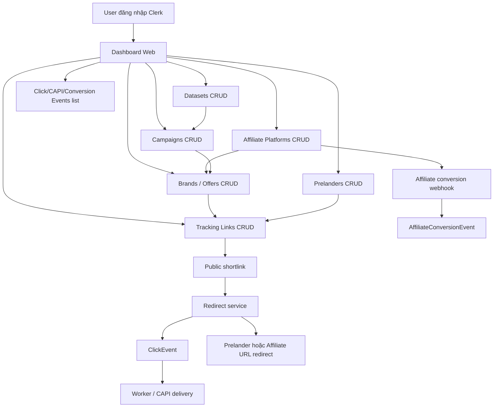
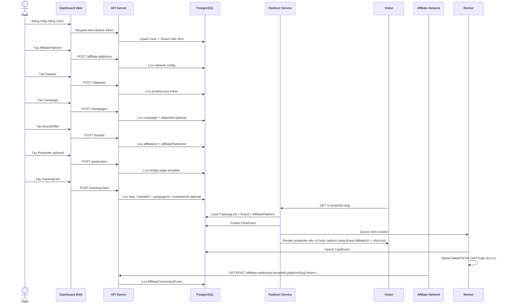
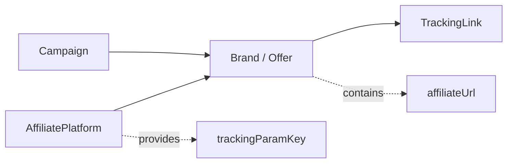
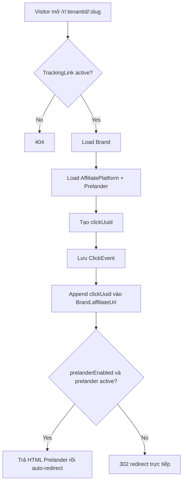
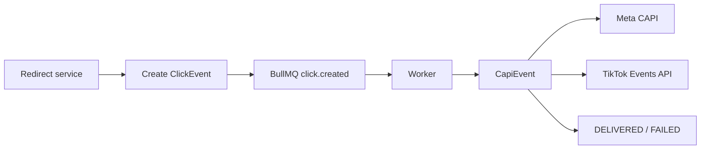
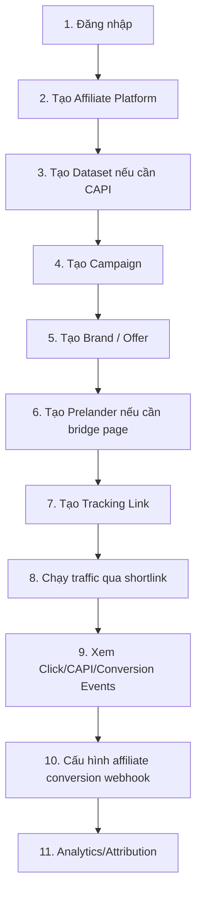
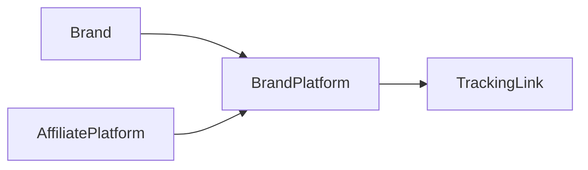
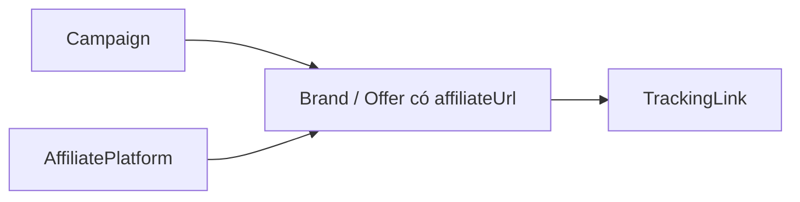

# Features Context

Tài liệu này mô tả chức năng hiện tại và hướng vận hành của Aff Track Pro sau các cập nhật mới nhất.

Mục tiêu sản phẩm: giúp user tạo affiliate tracking workspace, quản lý campaign/offer/network, tạo shortlink, ghi nhận click, nhận conversion webhook, và chuẩn bị dữ liệu cho CAPI/analytics.

## Tóm tắt ngắn

- Auth bằng Clerk.
- Mỗi user hiện có một tenant/workspace mặc định.
- User quản lý 6 module CRUD chính:
  - Campaigns
  - Brands / Offers
  - Affiliate Platforms
  - Datasets
  - Prelanders
  - Tracking Links
- Click public đi qua redirect service `/r/:tenantKey/:slug`.
- Conversion từ affiliate network đi vào API webhook `/affiliate-webhooks/:tenantId/:platformSlug?token=...`.
- Worker xử lý `click.created`, tạo/gửi CAPI PageView tới Meta/TikTok hoặc dry-run theo `CAPI_DRY_RUN`.
- Superadmin quản lý billing plans và cấp/tắt menu/function theo tenant.

## Sơ đồ feature tổng quan



## Luồng end-to-end chính



## 1. Auth và Workspace

### Mục đích

Xác thực user và tự động tạo workspace để scope dữ liệu.

### Hiện có

- Clerk frontend components:
  - `SignedIn`
  - `SignedOut`
  - `SignInButton`
  - `UserButton`
- API verify Clerk bearer token.
- Khi request API quản lý:
  1. API verify token.
  2. Lấy Clerk user.
  3. Upsert bảng `User`.
  4. Tạo `Tenant` mặc định nếu user chưa có.
- Tenant là boundary phân quyền.

### Ghi nhớ

Hiện model là **mỗi user một tenant/workspace**. Đây là context quan trọng khi đọc code: chưa có team/membership nhiều user trong một tenant.

## 2. Campaigns

### Mục đích

Campaign là nhóm chiến dịch quảng cáo/marketing. Campaign gom Brand/Offer, TrackingLink và ClickEvent.

### Chức năng UI hiện có

- Tạo campaign.
- Chọn dataset optional cho campaign.
- Xem danh sách campaign.
- Mở detail row.
- Sửa campaign inline.
- Xóa campaign.

### API hiện có

| Method | Endpoint | Mục đích |
| --- | --- | --- |
| `GET` | `/campaigns` | List campaign theo user/tenant. |
| `POST` | `/campaigns` | Tạo campaign. |
| `PUT` | `/campaigns/:id` | Sửa campaign. |
| `DELETE` | `/campaigns/:id` | Xóa campaign. |

### Body tạo/sửa chính

```json
{
  "tenantId": "tenant_uuid",
  "name": "Facebook VN",
  "datasetId": "dataset_uuid_or_empty"
}
```

### Lưu ý xóa

Xóa campaign có thể cascade Brand, TrackingLink, ClickEvent liên quan theo schema.

## 3. Datasets

### Mục đích

Dataset lưu pixel ID/access token của ad platform như Meta hoặc TikTok. Campaign có thể chọn một dataset để phục vụ CAPI/attribution sau này.

### Chức năng UI hiện có

- Tạo dataset.
- Chọn platform `meta` hoặc `tiktok`.
- Nhập name, pixel ID, access token.
- Xem danh sách dataset.
- Mở detail row.
- Sửa dataset inline.
- Bật/tắt active.
- Xóa dataset.
- Detail che access token một phần.

### API hiện có

| Method | Endpoint | Mục đích |
| --- | --- | --- |
| `GET` | `/datasets` | List datasets. |
| `POST` | `/datasets` | Tạo dataset. |
| `PUT` | `/datasets/:id` | Sửa dataset. |
| `DELETE` | `/datasets/:id` | Xóa dataset. |

### Body tạo/sửa chính

```json
{
  "tenantId": "tenant_uuid",
  "platform": "meta",
  "name": "Meta Pixel VN",
  "pixelId": "123456789",
  "accessToken": "token",
  "isActive": true
}
```

### Lưu ý xóa

Xóa dataset sẽ set `Campaign.datasetId = null`, không xóa campaign.

## 4. Affiliate Platforms

### Mục đích

AffiliatePlatform là cấu hình network/platform affiliate dùng chung trong workspace.

Ví dụ:

- Impact
- PartnerStack
- FirstPromoter
- CJ
- Rakuten
- Custom network

### AffiliatePlatform lưu gì?

- Tên network.
- Slug network.
- Tracking param key để append `clickUuid`, ví dụ `subid1`, `sid1`, `fp_sid`.
- Webhook method `GET` hoặc `POST`.
- Webhook token bí mật.

### AffiliatePlatform không lưu gì?

- Không lưu affiliate URL cụ thể của offer.
- Affiliate URL nằm trong `Brand.affiliateUrl`.

### Chức năng UI hiện có

- Tạo affiliate platform.
- Xem danh sách platform.
- Mở detail row.
- Xem webhook URL và token.
- Sửa name, slug, tracking param key, webhook method.
- Xóa platform.

### API hiện có

| Method | Endpoint | Mục đích |
| --- | --- | --- |
| `GET` | `/affiliate-platforms` | List platforms. |
| `POST` | `/affiliate-platforms` | Tạo platform. |
| `PUT` | `/affiliate-platforms/:id` | Sửa platform. |
| `DELETE` | `/affiliate-platforms/:id` | Xóa platform. |

### Body tạo/sửa chính

```json
{
  "tenantId": "tenant_uuid",
  "name": "Impact",
  "slug": "impact",
  "trackingParamKey": "subid1",
  "webhookMethod": "POST"
}
```

### Webhook URL

```txt
/affiliate-webhooks/:tenantId/:platformSlug?token=:webhookToken
```

## 5. Brands / Offers

### Mục đích

Brand/Offer là offer cụ thể thuộc một campaign. Đây là nơi lưu affiliate URL.

### Luồng đúng hiện tại



Khi tạo Brand/Offer:

1. Chọn Campaign.
2. Chọn AffiliatePlatform.
3. Nhập tên Brand/Offer.
4. Nhập affiliate URL.

Không cần bảng/form trung gian `BrandPlatform` trong luồng cơ bản.

### Chức năng UI hiện có

- Tạo Brand/Offer.
- Chọn Campaign.
- Chọn AffiliatePlatform.
- Nhập Affiliate URL.
- Xem danh sách Brand/Offer.
- Mở detail row.
- Sửa campaign/platform/name/affiliate URL inline.
- Xóa Brand/Offer.

### API hiện có

| Method | Endpoint | Mục đích |
| --- | --- | --- |
| `GET` | `/brands` | List brands/offers. |
| `POST` | `/brands` | Tạo brand/offer. |
| `PUT` | `/brands/:id` | Sửa brand/offer. |
| `DELETE` | `/brands/:id` | Xóa brand/offer. |

### Body tạo/sửa chính

```json
{
  "tenantId": "tenant_uuid",
  "campaignId": "campaign_uuid",
  "affiliatePlatformId": "platform_uuid",
  "name": "Demo SaaS Offer",
  "affiliateUrl": "https://example-affiliate-network.com/offer"
}
```

### Lưu ý xóa

Xóa Brand/Offer có thể cascade TrackingLink liên quan.

## 6. Prelanders

### Mục đích

Prelander là bridge page/template hiển thị trước khi visitor được chuyển sang affiliate URL. Mỗi tracking link có thể gắn một prelander cụ thể hoặc để trống để redirect thẳng/basic flow.

### Chức năng UI hiện có

- Tạo prelander.
- Nhập name, headline, body, CTA text.
- Chọn theme `clean`, `dark`, `warm`.
- Cấu hình delay auto-redirect bằng `ctaDelaySeconds`.
- Xem danh sách prelander.
- Mở detail row/trang detail.
- Sửa prelander.
- Bật/tắt active.
- Xóa prelander.

### API hiện có

| Method | Endpoint | Mục đích |
| --- | --- | --- |
| `GET` | `/prelanders` | List prelanders. |
| `POST` | `/prelanders` | Tạo prelander. |
| `PUT` | `/prelanders/:id` | Sửa prelander. |
| `DELETE` | `/prelanders/:id` | Xóa prelander. |

### Body tạo/sửa chính

```json
{
  "tenantId": "tenant_uuid",
  "name": "Warm bridge page",
  "headline": "Before you continue",
  "body": "Short trust-building message",
  "ctaText": "Continue",
  "ctaDelaySeconds": 2,
  "theme": "clean",
  "isActive": true
}
```

### Lưu ý xóa/tắt

- Xóa prelander sẽ set `TrackingLink.prelanderId = null`.
- Nếu tracking link có `prelanderEnabled = true` nhưng prelander không tồn tại hoặc inactive, redirect service sẽ redirect thẳng sang affiliate URL.

## 7. Tracking Links

### Mục đích

TrackingLink là shortlink public để ghi click và redirect sang affiliate URL của Brand/Offer.

### Chức năng UI hiện có

- Tạo tracking link.
- Chọn Brand/Offer.
- Nhập slug.
- Chọn prelander optional khi tạo/sửa.
- Bật/tắt prelander khi tạo/sửa.
- Xem danh sách tracking link.
- Mở detail row.
- Sửa Brand/Offer, slug, prelander, active inline.
- Xóa tracking link.
- Copy/mở shortlink public.

### API hiện có

| Method | Endpoint | Mục đích |
| --- | --- | --- |
| `GET` | `/tracking-links` | List tracking links. |
| `POST` | `/tracking-links` | Tạo tracking link. |
| `PUT` | `/tracking-links/:id` | Sửa tracking link. |
| `DELETE` | `/tracking-links/:id` | Xóa tracking link. |

### Body tạo/sửa chính

```json
{
  "tenantId": "tenant_uuid",
  "brandId": "brand_uuid",
  "prelanderId": "prelander_uuid_or_empty",
  "slug": "demo-offer",
  "prelanderEnabled": true,
  "isActive": true
}
```

### Public shortlink

```txt
/r/:tenantId/:slug
```

### Redirect logic



## 8. Click Events

### Mục đích

ClickEvent là dữ liệu gốc của tracking và attribution.

### Nguồn tạo ClickEvent

- Redirect service khi visitor click shortlink `/r/:tenantKey/:slug`.

### Dữ liệu capture

- `clickUuid`
- IP
- User agent
- Referrer
- `fbclid`
- `ttclid`
- `_fbp`
- `_ttp`
- `fbc` tạo từ `fbclid` nếu có
- Metadata bổ sung

### UI hiện có

- Trang Click Events hiển thị 100 click mới nhất.
- Hiển thị tracking link/slug.
- Hiển thị thời điểm click.
- Hiển thị `fbclid`, `ttclid`, hoặc `clickUuid`.

### API hiện có

| Method | Endpoint | Mục đích |
| --- | --- | --- |
| `GET` | `/click-events` | List click events gần nhất. |


## 10. Affiliate Conversion Webhook

### Mục đích

Nhận conversion/postback từ affiliate network.

### Endpoint

```txt
GET  /affiliate-webhooks/:tenantId/:platformSlug?token=:webhookToken
POST /affiliate-webhooks/:tenantId/:platformSlug?token=:webhookToken
```

API check:

- `tenantId`
- `platformSlug`
- `token`
- HTTP method phải khớp `AffiliatePlatform.webhookMethod`

### Cách tìm clickUuid

API ưu tiên lấy từ:

1. `clickUuid`
2. `subid1`
3. `sid1`
4. `fp_sid`
5. Key đúng theo `AffiliatePlatform.trackingParamKey`

### Dữ liệu lưu

Lưu vào `AffiliateConversionEvent`:

- `clickUuid`
- customer id/email nếu có
- spend/payout/commission nếu có
- currency nếu có
- raw payload
- received method

## 11. Queue và Worker / CAPI delivery

### Mục đích

Xử lý click event bất đồng bộ, chuẩn bị gửi CAPI.

### Luồng



### Hiện tại

- Redirect/API tạo click event rồi add job `click.created`.
- Worker nằm ở `apps/worker` và đọc queue BullMQ.
- Worker load `ClickEvent -> TrackingLink -> Campaign -> Dataset`.
- Nếu campaign chưa chọn active dataset thì worker skip, không tạo CAPI event.
- Nếu có dataset active:
  - `platform = meta` hoặc `tiktok` theo `Dataset.platform`.
  - Tạo payload PageView tương ứng Meta CAPI hoặc TikTok Events API.
  - Upsert `CapiEvent` theo `[clickEventId, platform, eventName]`.
  - Increment `attempts`, set `PROCESSING`, sau đó `DELIVERED` hoặc `FAILED`.
  - Lưu request/response/dryRun vào `CapiEvent.payload` để debug.
- `CAPI_DRY_RUN` mặc định bật. Chỉ gửi thật khi `CAPI_DRY_RUN=false`.

### Hướng tiếp theo

- Retry/backoff nâng cao theo `attempts`.
- Mapping thêm event ngoài PageView.
- UI chi tiết log delivery theo từng CAPI event.

## 12. Dashboard pages hiện tại

### Overview

Hiển thị:

- Tổng campaigns.
- Tổng tracking links.
- Tổng click events.
- Workspace info.
- Biểu đồ demo theo dữ liệu hiện tại.

### Campaigns

Có:

- Create form.
- Table list.
- Detail.
- Edit.
- Delete.

### Brands / Offers

Có:

- Create form.
- Table list.
- Detail.
- Edit.
- Delete.
- Link mở affiliate URL.

### Affiliate Platforms

Có:

- Create form.
- Table list.
- Detail.
- Edit.
- Delete.
- Webhook URL/token.

### Datasets

Có:

- Create form.
- Table list.
- Detail.
- Edit.
- Delete.
- Active/inactive.

### Prelanders

Có:

- Create form.
- Table list.
- Detail.
- Edit.
- Delete.
- Active/inactive.
- Theme/delay/CTA config.

### Tracking Links

Có:

- Create form.
- Table list.
- Detail.
- Edit.
- Delete.
- Public shortlink.
- Active/inactive.

### Click Events / CAPI Events / Conversion Events

Có:

- List 100 click event mới nhất.
- List 100 CAPI event mới nhất.
- List 100 conversion event mới nhất.

### Analytics

Có:

- Summary thật từ database: clicks, conversions, total CAPI, delivered CAPI, failed CAPI, conversion rate.

### Billing / Settings / Support

- Billing user-side hiện là placeholder plan/usage/invoices.
- Settings/Support hiện là placeholder pages.

### Super Admin

Có:

- Xem registered accounts đã có record trong DB.
- Xem workspace/tenant của account.
- Tạo/sửa billing plans.
- Assign billing plan cho tenant.
- Cấp/tắt menu/function cho tenant.
- Superadmin được xác định bằng env `SUPERADMIN_EMAILS` / `SUPERADMIN_CLERK_USER_IDS`.

## 13. API endpoint tổng hợp

### Auth / Tenant

| Method | Endpoint |
| --- | --- |
| `GET` | `/health` |
| `GET` | `/me` |
| `GET` | `/tenants` |

### CRUD chính

| Module | List | Create | Update | Delete |
| --- | --- | --- | --- | --- |
| Campaigns | `GET /campaigns` | `POST /campaigns` | `PUT /campaigns/:id` | `DELETE /campaigns/:id` |
| Brands / Offers | `GET /brands` | `POST /brands` | `PUT /brands/:id` | `DELETE /brands/:id` |
| Affiliate Platforms | `GET /affiliate-platforms` | `POST /affiliate-platforms` | `PUT /affiliate-platforms/:id` | `DELETE /affiliate-platforms/:id` |
| Datasets | `GET /datasets` | `POST /datasets` | `PUT /datasets/:id` | `DELETE /datasets/:id` |
| Prelanders | `GET /prelanders` | `POST /prelanders` | `PUT /prelanders/:id` | `DELETE /prelanders/:id` |
| Tracking Links | `GET /tracking-links` | `POST /tracking-links` | `PUT /tracking-links/:id` | `DELETE /tracking-links/:id` |

### Events / Webhooks

| Method | Endpoint | Mục đích |
| --- | --- | --- |
| `GET` | `/click-events` | List recent click events. |
| `GET` | `/capi-events` | List recent CAPI delivery events. |
| `GET` | `/conversion-events` | List recent affiliate conversion events. |
| `GET` | `/analytics/summary` | Summary clicks/conversions/CAPI. |
| `GET/POST` | `/affiliate-webhooks/:tenantId/:platformSlug?token=...` | Affiliate conversion webhook. |

### Superadmin

| Method | Endpoint | Mục đích |
| --- | --- | --- |
| `GET` | `/superadmin/users` | List registered users và tenant stats. |
| `GET` | `/superadmin/billing-plans` | List billing plans. |
| `POST` | `/superadmin/billing-plans` | Tạo billing plan. |
| `PUT` | `/superadmin/billing-plans/:id` | Sửa billing plan. |
| `GET` | `/superadmin/menu-features` | List active menu features. |
| `PUT` | `/superadmin/tenants/:id/menu-features` | Cấp/tắt menu features cho tenant. |
| `PUT` | `/superadmin/tenants/:id/billing-plan` | Assign billing plan cho tenant. |

## 14. Thứ tự setup khuyến nghị cho user



## 15. Những điểm cần tránh nhầm

### Brand không phải AffiliatePlatform

- `AffiliatePlatform`: network, ví dụ Impact.
- `Brand/Offer`: offer cụ thể, ví dụ Demo SaaS Offer.

### Affiliate URL không nằm ở TrackingLink

- Affiliate URL nằm ở `Brand.affiliateUrl`.
- TrackingLink chỉ trỏ tới Brand.

### Tracking param key không nằm ở Brand

- Param key nằm ở `AffiliatePlatform.trackingParamKey`.
- Khi redirect, hệ thống lấy param key từ platform của Brand.

### Không dùng BrandPlatform trong luồng cơ bản

Luồng cũ:



Luồng hiện tại:



Lý do:

- Ít bước hơn.
- Dễ hiểu hơn cho user.
- Phù hợp mô hình mỗi offer có một affiliate URL chính.

### Prelander không phải TrackingLink

- `Prelander`: nội dung bridge page/template.
- `TrackingLink`: shortlink public capture click và quyết định dùng prelander nào.
- `prelanderEnabled=false` luôn redirect thẳng dù có `prelanderId`.
- `prelanderId` null hoặc prelander inactive cũng redirect thẳng.

### CAPI delivery phụ thuộc Dataset của Campaign

- TrackingLink không chọn dataset trực tiếp.
- Worker lấy dataset qua `TrackingLink -> Campaign -> Dataset`.
- Campaign không có active dataset thì worker skip CAPI cho click đó.

## 16. Roadmap chức năng tiếp theo

Các phần nên triển khai sau:

- Analytics chi tiết theo campaign/brand/platform.
- Attribution conversion về click bằng `clickUuid`.
- Revenue/payout/commission dashboard.
- CAPI delivery nâng cao: retry/backoff, dead-letter, event mapping ngoài PageView.
- Copy button cho webhook URL và shortlink.
- Pagination/filter/search cho bảng lớn.
- Prelander builder nâng cao/custom domain/SEO controls.
- Multi-member workspace nếu cần nhiều user trong cùng tenant.
- Audit log cho thao tác sửa/xóa.
