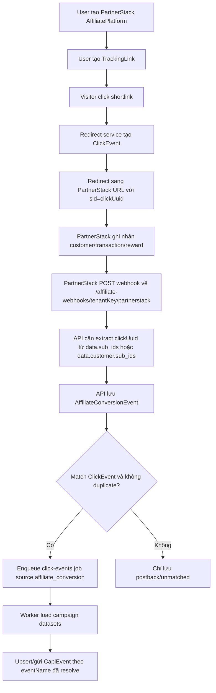

# PartnerStack Core Flow

Tài liệu này mô tả phần core hiện tại của PartnerStack trong hệ thống: tạo tracking link, truyền click id sang PartnerStack, nhận postback/webhook, lưu `AffiliateConversionEvent`, và trigger CAPI qua worker.

Last reviewed: 2026-06-06.

## File liên quan

- `packages/shared/src/index.ts`
  - Định nghĩa platform PartnerStack.
  - Định nghĩa tracking param key.
  - Định nghĩa queue `click-events`.
  - Định nghĩa helper event mapping generic.
- `apps/api/src/server.ts`
  - CRUD Affiliate Platform.
  - CRUD Tracking Link.
  - Endpoint nhận affiliate webhook/postback.
  - Resolve event name.
  - Lưu `AffiliateConversionEvent`.
  - Enqueue CAPI job khi postback match click.
- `apps/redirect/src/server.ts`
  - Public shortlink redirect.
  - Tạo `ClickEvent`.
  - Gắn `sid=<clickUuid>` vào PartnerStack affiliate URL.
- `apps/worker/src/worker.ts`
  - Consume queue `click-events`.
  - Build Meta/TikTok payload.
  - Upsert/gửi `CapiEvent`.
- `apps/web/src/features/resources/ResourcePages.tsx`
  - Hiển thị webhook URL cho Affiliate Platform.

## Định nghĩa PartnerStack hiện tại

Trong `packages/shared/src/index.ts`:

```ts
{ key: 'partnerstack', label: 'PartnerStack', slug: 'partnerstack', trackingParamKey: 'sid', webhookMethod: 'POST', defaultEventName: 'CompleteRegistration' }
```

Aliases được hỗ trợ:

```txt
partnerstack -> partnerstack
sid          -> partnerstack
sid1         -> partnerstack
```

Ý nghĩa:

- Platform key: `partnerstack`.
- Slug webhook: `partnerstack`.
- Tracking param truyền sang PartnerStack: `sid`.
- Webhook method mặc định: `POST`.
- Event fallback: `CompleteRegistration`.

## Luồng tạo Affiliate Platform PartnerStack

Route API:

```http
POST /affiliate-platforms
```

Khi user tạo platform và chọn PartnerStack:

1. API nhận `tenantId`, `name`, `platform`/`platformKey`.
2. `getAffiliatePlatformChoice()` resolve platform supported.
3. API tạo `AffiliatePlatform` với base data:

```ts
{
  trackingParamKey: 'sid',
  webhookMethod: 'POST',
  defaultEventName: 'CompleteRegistration',
  eventMapping: []
}
```

4. `webhookToken` vẫn có trong DB schema nhưng endpoint hiện tại không check token.
5. UI hiển thị webhook URL dạng:

```txt
{API_BASE_URL}/affiliate-webhooks/{tenantPublicKey hoặc tenantId}/partnerstack
```

## Luồng tạo Tracking Link PartnerStack

Route API:

```http
POST /tracking-links
```

Khi tạo tracking link:

1. User chọn `affiliatePlatformId` của PartnerStack.
2. API validate platform thuộc tenant hiện tại.
3. API lưu `TrackingLink` gồm:
   - `tenantId`
   - `campaignId`
   - `brandId`
   - `affiliatePlatformId`
   - `affiliateUrl`
   - `slug`
   - prelander config nếu có
   - `isActive`

Lưu ý: `sid` chưa được append khi tạo tracking link. `sid` chỉ được append runtime khi visitor click shortlink.

## Luồng click shortlink

Route redirect service:

```http
GET /:slug/:tenantKey
```

Ví dụ:

```txt
https://redirect-domain.com/my-offer/{tenantPublicKey}
```

Khi visitor mở shortlink:

1. Redirect service tìm `TrackingLink` bằng `slug + tenantKey`.
2. Validate link tồn tại và `isActive = true`.
3. Tạo `ClickEvent` mới:

```ts
{
  tenantId,
  campaignId,
  trackingLinkId,
  clickUuid: randomUUID(),
  ip,
  userAgent,
  referrer,
  fbp,
  fbc,
  ttp,
  ttclid,
  fbclid,
  metadata: { slug, tenantKey, tenantId, source: 'redirect' }
}
```

4. Enqueue CAPI event ban đầu từ click. Hiện redirect service đang dùng event browser/CAPI click ban đầu là:

```txt
AddToCart
```

5. Build affiliate redirect URL:

```ts
buildAffiliateRedirectUrl(
  trackingLink.affiliateUrl,
  resolveTrackingParamKey(trackingLink.affiliatePlatform),
  clickEvent.clickUuid
)
```

Với PartnerStack:

```txt
resolveTrackingParamKey(...) = sid
```

Affiliate URL cuối cùng:

```txt
https://partnerstack-affiliate-url...?sid=<clickUuid>
```

Điểm bắt buộc về mặt tracking: PartnerStack phải trả lại click id đã nhận từ affiliate URL. Tuy nhiên payload thực tế không trả top-level `sid`; PartnerStack trả click id trong các mảng nested `sub_ids`.

## Endpoint nhận PartnerStack postback

Route API public:

```http
GET/POST /affiliate-webhooks/:tenantKey/:platformSlug
```

Với PartnerStack:

```http
POST /affiliate-webhooks/{tenantPublicKey}/partnerstack
```

Hoặc nếu dùng tenant id:

```http
POST /affiliate-webhooks/{tenantId}/partnerstack
```

## Cấu hình webhook PartnerStack theo hình gửi

Hình cấu hình webhook PartnerStack đang bật:

| Object | Create | Update | Delete |
| --- | --- | --- | --- |
| Customer | Bật | Bật | Tắt |
| Transaction | Bật | Bật | Tắt/disabled |
| Commission | Bật | Bật | Tắt/disabled |
| Action | Bật | Bật | Tắt/disabled |

Ý nghĩa kỳ vọng:

- PartnerStack gửi webhook khi Customer/Transaction/Commission/Action được tạo hoặc cập nhật.
- Delete event không được gửi.
- Các case thực tế trong `test/partnerstack.md` đang có:
  - `customer.created`
  - `customer.updated`
  - `transaction.created`
  - `reward.created` - đây là object reward/commission/payout trong payload thực tế.

## Format postback thực tế từ `test/partnerstack.md`

PartnerStack gửi JSON body dạng:

```json
{
  "event": "<object>.<action>",
  "data": { "...": "..." },
  "test": false
}
```

Nếu đi qua n8n, dữ liệu có thể được wrap thêm:

```json
[
  {
    "headers": { "content-type": "application/json" },
    "params": {},
    "query": {},
    "body": {
      "event": "transaction.created",
      "data": { "...": "..." },
      "test": false
    },
    "webhookUrl": "https://n8n.dbaiagents.com/webhook/postback-partnerstack",
    "executionMode": "production"
  }
]
```

`normalizeAffiliateWebhookPayload()` hiện có thể unwrap dạng n8n này thành top-level `event`, `data`, `test`.

### Case 1: `customer.created`

Payload chính:

```json
{
  "event": "customer.created",
  "data": {
    "key": "cus_AcOLfPJYaM7mfF",
    "sub_ids": [],
    "shared_id": null,
    "has_paid": false,
    "company": {
      "key": "co_0wGrIBXWHBf02A",
      "name": "Eleven Labs Inc."
    },
    "partnership_key": "part_MonH6KAwdrU9qL",
    "customer_name": "006c55d38d164e2ca31be397a69304b2",
    "customer_email": "006c55d38d164e2ca31be397a69304b2@email.com",
    "created_at": 1778778600731,
    "updated_at": 1778778600731
  },
  "test": false
}
```

Nhận xét:

- Chưa có click id vì `data.sub_ids = []`.
- `has_paid = false`.
- Đây là event tạo customer ban đầu, thường chưa đủ dữ liệu attribution để gửi CAPI.
- `data.created_at` là timestamp tạo customer. Đây là thời điểm nên dùng cho CAPI `CompleteRegistration.event_time` nếu sau đó customer mới có `sub_ids`.
- `data.fields[]` đã có attribute khách hàng như `api_name=email`, `api_name=name`, `api_name=source_type`; các field có `value` nên được extract để enrich CAPI.

### Case 2: `customer.updated`

Payload chính:

```json
{
  "event": "customer.updated",
  "data": {
    "key": "cus_AcOLfPJYaM7mfF",
    "sub_ids": ["8ecd4270-989e-4eb3-9345-9bebf99a8c98"],
    "shared_id": null,
    "has_paid": true,
    "customer_name": "006c55d38d164e2ca31be397a69304b2",
    "customer_email": "006c55d38d164e2ca31be397a69304b2@email.com",
    "created_at": 1778778601000,
    "updated_at": 1778779035345
  },
  "test": false
}
```

Nhận xét:

- Click id nằm ở `data.sub_ids[0]`.
- Không có top-level `sid`.
- `has_paid = true`, có thể là dấu hiệu customer đã chuyển trạng thái sau transaction.
- `customer.updated` có thể được PartnerStack gửi nhiều lần cho cùng `data.key`; không nên coi mỗi update là một `CompleteRegistration` mới.
- Nên coi `customer.updated` là tín hiệu bổ sung attribution: khi lần đầu thấy `sub_ids[0]` cho customer, gửi một `CompleteRegistration` duy nhất.
- `data.created_at` trong `customer.updated` vẫn là thời điểm customer được tạo. Với CompleteRegistration, CAPI `event_time` nên lấy từ `data.created_at`, không lấy `updated_at` và không lấy thời điểm webhook update được nhận.

### Case 3: `transaction.created`

Payload chính:

```json
{
  "event": "transaction.created",
  "data": {
    "archived": false,
    "partnership_key": "part_MonH6KAwdrU9qL",
    "amount": 660,
    "currency": "USD",
    "amount_usd": 660,
    "company": {
      "key": "co_0wGrIBXWHBf02A",
      "name": "Eleven Labs Inc."
    },
    "customer": {
      "key": "cus_AcOLfPJYaM7mfF",
      "sub_ids": ["8ecd4270-989e-4eb3-9345-9bebf99a8c98"],
      "shared_id": null
    },
    "key": "ch_3TX2p4LmdOdiMXBs1S7cEV4Y",
    "created_at": 1778779035165,
    "updated_at": 1778779035182
  },
  "test": false
}
```

Nhận xét:

- Click id nằm ở `data.customer.sub_ids[0]`.
- Transaction id nằm ở `data.key` dạng `ch_...`.
- Customer id nằm ở `data.customer.key` dạng `cus_...`.
- Giá trị mua hàng nằm ở `data.amount` và `data.amount_usd`.
- Đây là event phù hợp nhất để trigger `Purchase`.

### Case 4: `reward.created` / commission

Payload chính:

```json
{
  "event": "reward.created",
  "data": {
    "partnership_key": "part_MonH6KAwdrU9qL",
    "payment_status": null,
    "withdrawn": false,
    "customer": {
      "key": "cus_AcOLfPJYaM7mfF",
      "sub_ids": ["8ecd4270-989e-4eb3-9345-9bebf99a8c98"],
      "shared_id": null,
      "name": "006c55d38d164e2ca31be397a69304b2",
      "email": "006c55d38d164e2ca31be397a69304b2@email.com"
    },
    "source": {
      "type": "transaction",
      "key": "ch_3TX2p4LmdOdiMXBs1S7cEV4Y"
    },
    "transaction": {
      "currency": "USD",
      "amount": 660,
      "amount_usd": 660
    },
    "description": "Earn 22% on every customer transaction for the first 12 months of customers lifetime! - $6.60 USD purchase by 006c55d38d164e2ca31be397a69304b2",
    "amount": 145,
    "reward_status": "scheduled",
    "currency": "USD",
    "key": "rwrd_GivmMOp9cvu26w",
    "created_at": 1786555035165,
    "updated_at": 1778779102063
  },
  "test": false
}
```

Nhận xét:

- Click id nằm ở `data.customer.sub_ids[0]`.
- Reward/commission id nằm ở `data.key` dạng `rwrd_...`.
- Source transaction id nằm ở `data.source.key`.
- Customer spend/order amount nằm ở `data.transaction.amount` / `data.transaction.amount_usd`.
- Commission/reward amount nằm ở `data.amount`.
- Đây là event phù hợp để trigger custom event `Payout`/`Commission`, không nên mặc định coi là `Purchase` nếu `transaction.created` đã gửi `Purchase`, để tránh double-count revenue.

## Field click id thực tế

Các field click id hiện code đang hỗ trợ ở top-level:

```txt
clickUuid
click_uuid
click_id
subid
sub_id
subid1
sid
sid1
fp_sid
<trackingParamKey của platform>
```

Với PartnerStack thực tế, cần đọc thêm nested paths:

```txt
data.sub_ids[0]
data.customer.sub_ids[0]
data.customer.sub_ids[*]
```

Không nên chỉ kỳ vọng top-level `sid`.

## Field `data.fields[]` thực tế

Customer payload của PartnerStack có mảng:

```json
[
  { "api_name": "name", "value": "006c55d38d164e2ca31be397a69304b2" },
  { "api_name": "email", "value": "006c55d38d164e2ca31be397a69304b2@email.com" },
  { "api_name": "company_name", "value": null },
  { "api_name": "website", "value": null },
  { "api_name": "phone", "value": null },
  { "api_name": "country_iso", "value": "Hong Kong" },
  { "api_name": "source_type", "value": "link" }
]
```

Cần normalize thành map theo `api_name`, chỉ giữ field có `value` khác `null/undefined/empty`:

```ts
function buildPartnerStackFieldMap(data: AnyRecord) {
  const fields = Array.isArray(data.fields) ? data.fields : []
  return Object.fromEntries(
    fields
      .filter((field) => field && typeof field === 'object')
      .map((field) => field as AnyRecord)
      .map((field) => [String(field.api_name ?? '').trim(), field.value] as const)
      .filter(([apiName, value]) => apiName && isFilledPayloadValue(value))
  )
}
```

Ưu tiên dùng field map để enrich:

| Enrichment | Priority path |
| --- | --- |
| `customerEmail` | `data.customer_email` -> `data.customer.email` -> `fieldMap.email` |
| `customerId` | `data.key` hoặc `data.customer.key` |
| `customerName` | `data.customer_name` -> `data.customer.name` -> `fieldMap.name` |
| `customerPhone` | `fieldMap.phone` |
| `country` | `fieldMap.country_iso` hoặc field country khác; nếu có thể nên normalize về ISO/lowercase trước khi hash cho Meta |
| `companyName` | `fieldMap.company_name` hoặc `data.company.name` |
| `website` | `fieldMap.website` |
| `sourceType` | `fieldMap.source_type` |

Không nên bỏ qua `fields[]` vì `customer.created` có thể chưa có click id nhưng đã có email/name/source, còn `customer.updated` có click id và vẫn giữ lại các field này.

## Normalize payload

Webhook handler gọi:

```ts
normalizeAffiliateWebhookPayload(...)
sanitizeWebhookPayload(...)
```

`normalizeAffiliateWebhookPayload()` xử lý được hai dạng:

1. Payload trực tiếp từ PartnerStack:

```json
{ "event": "transaction.created", "data": { "key": "ch_..." }, "test": false }
```

2. Payload bị wrap bởi n8n:

```json
[{ "headers": {}, "query": {}, "body": { "event": "transaction.created", "data": {} } }]
```

Sau normalize, payload còn dạng:

```json
{ "event": "transaction.created", "data": { "key": "ch_..." }, "test": false }
```

`sanitizeWebhookPayload()` xóa các field nhạy cảm nếu có:

```txt
token
webhookToken
accessToken
```

Sau đó payload được dùng để:

- Extract `clickUuid`.
- Resolve event name.
- Extract money/customer fields.
- Build idempotency key.
- Lưu raw payload.

Gap hiện tại với payload PartnerStack thực tế:

- `getPayloadValue()` chỉ tìm top-level key hoặc top-level key case-insensitive.
- Không đọc nested `data.sub_ids`, `data.customer.sub_ids`, `data.amount`, `data.key`, `data.customer.email`.
- Không đọc nested event time `data.created_at` / `data.updated_at` để tính CAPI `event_time` hoặc postback delay.
- Vì vậy real PartnerStack payload hiện có thể lưu postback nhưng không match click, không parse đúng money/customer/idempotency/delay.

## Resolve event name hiện tại cho PartnerStack

Trong `apps/api/src/server.ts`:

```ts
function resolvePlatformEventName(platform, payload) {
  const supported = getSupportedAffiliatePlatform(...)
  if (supported?.key === 'impact') { ... }
  if (supported) return { eventName: normalizeEventName(platform.defaultEventName ?? supported.defaultEventName) }
  ...
}
```

Vì PartnerStack là supported platform nhưng không phải Impact, hệ thống hiện tại trả thẳng về default event name:

```txt
CompleteRegistration
```

Hệ quả với các case thực tế:

| PartnerStack event | Ý nghĩa | Event hiện tại nếu code xử lý được click | Event nên cân nhắc |
| --- | --- | --- | --- |
| `customer.created` | Customer mới được tạo, thường chưa có `sub_ids`, `has_paid=false` | `CompleteRegistration` nhưng thường không match click | Không gửi CAPI, hoặc chỉ gửi Lead nếu có `sub_ids` |
| `customer.updated` | Customer được cập nhật, case thực tế có `sub_ids` và `has_paid=true` | `CompleteRegistration` | `CompleteRegistration` hoặc `Lead` nếu muốn track customer attribution |
| `transaction.created` | Giao dịch mới, có `data.amount`, `currency`, `customer.sub_ids` | `CompleteRegistration` | `Purchase` |
| `reward.created` | Reward/commission/payout được tạo, có `data.amount` là commission và `data.transaction.amount` là order amount | `CompleteRegistration` | Custom `Payout`/`Commission`; tránh gửi `Purchase` lần hai nếu `transaction.created` đã gửi |
| `action.created` / `action.updated` | Đang bật trên PartnerStack nhưng chưa có sample trong `test/partnerstack.md` | `CompleteRegistration` | Cần sample trước khi map |

- PartnerStack `eventMapping` đang bị bỏ qua cho supported platform.
- Không có custom trigger theo payload PartnerStack ở runtime hiện tại.
- Muốn map đúng `transaction.created -> Purchase` và `reward.created -> Payout`, phải sửa resolver để PartnerStack dùng `eventMapping` hoặc rule riêng.

## Extract money/customer fields

PartnerStack không phải Impact nên `extractConversionMoney()` hiện dùng nhóm field generic top-level.

Spend amount hiện code đọc ở top-level:

```txt
spendAmount
spend_amount
spend
cost
ad_spend
```

Payout/revenue amount hiện code đọc ở top-level:

```txt
payoutAmount
payout_amount
payout
revenue
sale_amount
amount
value
```

Commission amount hiện code đọc ở top-level:

```txt
commissionAmount
commission_amount
commission
profit
```

Currency hiện code đọc ở top-level:

```txt
currency
currencyCode
currency_code
```

Default currency nếu không có:

```txt
USD
```

Customer fields hiện code đọc ở top-level:

```txt
customerId
customer_id
userId
user_id
externalId
external_id
customerEmail
customer_email
email
```

Với PartnerStack thực tế, các field cần đọc là nested:

| Mục tiêu | Case | Path thực tế | Ghi chú |
| --- | --- | --- | --- |
| click uuid | `customer.updated` | `data.sub_ids[0]` | UUID attribution |
| click uuid | `transaction.created` | `data.customer.sub_ids[0]` | UUID attribution |
| click uuid | `reward.created` | `data.customer.sub_ids[0]` | UUID attribution |
| customer id | customer/transaction/reward | `data.key` hoặc `data.customer.key` | `cus_...` |
| customer email | customer events | `data.customer_email` hoặc `data.fields[api_name=email].value` | top-level trong `data` + field map |
| customer email | reward events | `data.customer.email` | nested |
| customer name | customer events | `data.customer_name` hoặc `data.fields[api_name=name].value` | nested trong `data` + field map |
| customer phone | customer events | `data.fields[api_name=phone].value` | field map |
| country | customer events | `data.fields[api_name=country_iso].value` | field map; nên normalize nếu dùng cho CAPI |
| source type | customer events | `data.fields[api_name=source_type].value` | ví dụ `link` |
| transaction id | transaction event | `data.key` | `ch_...` |
| transaction id | reward event | `data.source.key` | source transaction |
| reward id | reward event | `data.key` | `rwrd_...` |
| order amount | transaction event | `data.amount` / `data.amount_usd` | 660 trong sample |
| order amount | reward event | `data.transaction.amount` / `data.transaction.amount_usd` | 660 trong sample |
| commission/payout | reward event | `data.amount` | 145 trong sample |
| currency | transaction/reward | `data.currency` hoặc `data.transaction.currency` | USD |
| event time | all | `data.created_at`, `data.updated_at` | milliseconds epoch trong sample |

Current code gap:

- Không parse được nested money nên `transaction.created` có thể không lưu `spendAmount/payoutAmount` đúng.
- Không parse được `reward.created` commission `data.amount` hoặc transaction value `data.transaction.amount`.
- Không enrich được `customerEmail` từ `data.customer_email` / `data.customer.email` / `data.fields[api_name=email].value`.
- Không extract được các field có `api_name` như `name`, `phone`, `country_iso`, `company_name`, `website`, `source_type`.

## Idempotency / duplicate handling

API build idempotency key bằng thứ tự ưu tiên:

1. Header:

```txt
x-idempotency-key
```

2. Payload:

```txt
idempotencyKey
idempotency_key
```

3. Network id trong payload top-level:

```txt
conversionId
conversion_id
transactionId
transaction_id
orderId
order_id
saleId
sale_id
leadId
lead_id
eventId
event_id
postbackId
postback_id
id
```

Với PartnerStack thực tế, network ids nằm nested và hiện chưa được idempotency helper đọc:

```txt
data.key                  # customer key cus_..., transaction key ch_..., reward key rwrd_...
data.customer.key         # customer key trong transaction/reward
data.source.key           # source transaction key trong reward
event + data.key          # key idempotency nên dùng an toàn nhất cho từng object event
```

Khuyến nghị idempotency PartnerStack:

- Không dùng full payload hash cho `customer.updated` vì `updated_at`/field khác thay đổi sẽ tạo key mới và gửi trùng CAPI.
- Với `CompleteRegistration` từ customer event, dùng semantic key theo customer, độc lập với raw webhook event:

```txt
partnerstack:complete_registration:{data.key}
```

- DB unique đã scope theo `tenantId + affiliatePlatformId`, nên key này đủ để mỗi customer chỉ gửi một `CompleteRegistration`.
- Nếu muốn dedupe cả trường hợp `customer.created` có `sub_ids` và `customer.updated` cũng có `sub_ids`, key phải dựa trên `eventName + customerKey`, không dựa trên `event + data.key`.
- `transaction.created/transaction.updated`: dùng `partnerstack:transaction:{data.key}` hoặc `eventName + data.key` nếu muốn phân biệt `Purchase`/event khác.
- `reward.created/reward.updated`: dùng `partnerstack:reward:{data.key}`; lưu thêm `data.source.key` để liên kết transaction.
- Nếu PartnerStack retry cùng object, duplicate chỉ tăng `requestCount` và không enqueue CAPI lại.
- Nếu PartnerStack gửi update cùng object với `updated_at` khác, semantic key vẫn phải coi là duplicate cho `CompleteRegistration`.

4. Nếu không có các field trên, dùng hash của:

```ts
{
  platformId,
  clickUuid,
  eventName,
  payload
}
```

Unique DB key:

```txt
tenantId + affiliatePlatformId + idempotencyKey
```

Nếu duplicate:

- Update row cũ.
- Increment `requestCount`.
- Không enqueue CAPI lại.

## CompleteRegistration từ `customer.updated` nhưng `event_time` là `customer.created`

Vấn đề chính: `customer.created` thường đến trước nhưng `data.sub_ids = []`; `customer.updated` đến sau mới có `data.sub_ids[0]` để match click. Nếu map mọi `customer.updated` thành `CompleteRegistration`, PartnerStack có thể gửi nhiều update và tạo nhiều CAPI trùng.

Hướng xử lý đúng:

1. Dùng `customer.updated` như attribution completion signal, không dùng như một conversion mới mỗi lần update.
2. Chỉ xét gửi `CompleteRegistration` khi:
   - `event = customer.updated` hoặc `event = customer.created`.
   - Có `customerKey = data.key`.
   - Có `clickUuid = data.sub_ids[0]`.
   - Match được `ClickEvent` theo `tenantId + clickUuid`.
   - Semantic idempotency key `partnerstack:complete_registration:{customerKey}` chưa tồn tại.
3. CAPI vẫn dùng click data từ `ClickEvent`:
   - IP/user-agent.
   - `fbp`, `fbc`, `fbclid`.
   - `ttp`, `ttclid`.
   - campaign/tracking link/dataset.
4. CAPI `event_time` cho `CompleteRegistration` dùng thời điểm customer được tạo:
   - Primary: `data.created_at` trong chính `customer.updated` payload.
   - Nếu missing: lookup row `customer.created` đã lưu cùng `data.key` và lấy `rawPayload.data.created_at`.
   - Fallback cuối: thời điểm nhận conversion/postback.
5. Không dùng `data.updated_at` làm `CompleteRegistration.event_time`.
6. Không include `updated_at`, `requestCount`, hoặc raw payload hash trong key/event id của `CompleteRegistration`.

Ví dụ enrichment nên lưu:

```json
{
  "eventTime": "ISO string from data.created_at",
  "eventTimeMs": 1778778601000,
  "partnerstackEvent": "customer.updated",
  "partnerstackCustomerKey": "cus_AcOLfPJYaM7mfF",
  "customerId": "cus_AcOLfPJYaM7mfF",
  "customerEmail": "006c55d38d164e2ca31be397a69304b2@email.com",
  "partnerstackFields": {
    "name": "006c55d38d164e2ca31be397a69304b2",
    "email": "006c55d38d164e2ca31be397a69304b2@email.com",
    "source_type": "link"
  },
  "eventId": "CompleteRegistration_8ecd4270-989e-4eb3-9345-9bebf99a8c98"
}
```

Lưu ý timestamp sample `1778778601000` là milliseconds epoch. Khi gửi Meta CAPI cần convert sang seconds:

```ts
event_time = Math.floor(partnerStackCreatedAtMs / 1000)
```

## Postback delay / độ trễ nhận webhook

Cần tách 2 thời điểm:

```txt
actualEventAt    = thời điểm sự kiện thật sự xảy ra trong PartnerStack payload
postbackReceived = thời điểm API nhận webhook, thường là now/server time
postbackDelay    = postbackReceived - actualEventAt
```

Với PartnerStack, `actualEventAt` nên lấy theo event đang gửi CAPI:

| CAPI event | PartnerStack trigger | actualEventAt nên dùng | Ghi chú |
| --- | --- | --- | --- |
| `CompleteRegistration` | `customer.updated` lần đầu có `sub_ids` | `data.created_at` | Thời điểm customer được tạo, không phải `updated_at` |
| `Purchase` | `transaction.created` | `data.created_at` | Thời điểm transaction được tạo |
| `Payout`/`Commission` | `reward.created` | `data.created_at` | Thời điểm reward/commission được tạo |
| debug update latency | `customer.updated` | `data.updated_at` | Chỉ dùng để đo update webhook latency, không dùng cho CompleteRegistration CAPI |

Công thức:

```ts
const actualEventAt = new Date(partnerStackCreatedAtMs)
const postbackReceivedAt = now // thời điểm handler nhận webhook
const postbackDelaySeconds = Math.round((postbackReceivedAt.getTime() - actualEventAt.getTime()) / 1000)
```

Nên lưu/hiển thị ít nhất:

```txt
postbackEventAt          # ISO từ actualEventAt
postbackEventDateField   # ví dụ data.created_at
postbackEventDateValue   # raw value, ví dụ 1778778601000
postbackDelaySeconds     # delay lần nhận đầu tiên: conversion.createdAt - actualEventAt
lastPostbackDelaySeconds # nếu cần: conversion.lastReceivedAt - actualEventAt
```

Hiện code đã có logic delay generic trong `serializeConversion()`:

```ts
postbackDelaySeconds = getPostbackDelaySeconds(e.createdAt, postbackEventDate.date)
```

Nhưng logic này chỉ đọc các key ngày ở top-level như `EventDate`, `CreationDate`, `ConversionDate`, `TransactionDate`, `Timestamp`. Nó phù hợp hơn với Impact, nhưng chưa bắt được PartnerStack vì timestamp nằm nested ở `data.created_at` và là milliseconds epoch. Vì vậy PartnerStack hiện chưa tính đúng delay nếu chưa bổ sung parser nested.

Parser PartnerStack nên hỗ trợ số milliseconds/seconds:

```ts
function parsePartnerStackTimestamp(value: unknown) {
  const n = typeof value === 'number' ? value : Number(String(value).trim())
  if (!Number.isFinite(n)) return null
  return new Date(n > 1_000_000_000_000 ? n : n * 1000)
}
```

Nếu `postbackDelaySeconds` âm, cần coi là clock skew/future timestamp và log/debug, không nên dùng `data.updated_at` để thay thế `event_time` của `CompleteRegistration`.

Worker hiện tại chưa dùng được `capiEnrichment.eventTime` đúng cách vì:

```ts
return compactObject({
  ...extra,
  ...
  eventTime: conversion.createdAt
})
```

`eventTime: conversion.createdAt` đang overwrite `extra.eventTime`. Ngoài ra `buildMetaPayload()` / `buildTikTokPayload()` chỉ nhận `eventTime instanceof Date`; nếu `eventTime` lưu trong JSON là string/number thì sẽ fallback sai. Cần sửa worker để parse `extra.eventTime`/`extra.eventTimeMs` trước, rồi mới fallback `conversion.createdAt` hoặc `clickEvent.createdAt`.

## Lưu AffiliateConversionEvent

Webhook PartnerStack sẽ tạo/update `AffiliateConversionEvent` với các field chính:

```txt
tenantId
affiliatePlatformId
clickEventId
clickUuid
idempotencyKey
requestCount
lastReceivedAt
eventName
eventRule
eventMatchedField
eventMatchedValue
customerId
customerEmail
spendAmount
payoutAmount
commissionAmount
currency
attributionSnapshot
capiEnrichment
rawPayload
receivedMethod
```

Với PartnerStack hiện tại:

```txt
eventName = CompleteRegistration
```

## Điều kiện trigger CAPI từ PartnerStack postback

CAPI chỉ được enqueue nếu tất cả điều kiện đúng:

1. Postback không duplicate theo semantic idempotency key của event đang gửi.
   - Riêng `CompleteRegistration` PartnerStack: duplicate key phải là `partnerstack:complete_registration:{customerKey}` để chặn nhiều `customer.updated`.
2. Payload có click uuid.
3. API tìm được `ClickEvent` theo:

```txt
tenantId + clickUuid
```

4. Conversion được tạo thành công.
5. Campaign của click có ít nhất một active dataset.

Với payload PartnerStack thực tế, click uuid cần lấy từ:

```txt
data.sub_ids[0]
data.customer.sub_ids[0]
```

Trạng thái hiện tại của code:

- Chỉ đọc `sid`/alias ở top-level.
- Không đọc nested `data.sub_ids` hoặc `data.customer.sub_ids`.
- Do đó các case `customer.updated`, `transaction.created`, `reward.created` trong `test/partnerstack.md` sẽ không match click nếu gửi trực tiếp vào API hiện tại.
- Hệ thống vẫn có thể lưu `AffiliateConversionEvent`, nhưng `matched=false` và không enqueue CAPI.

Nếu không match click:

- Vẫn có thể lưu `AffiliateConversionEvent`.
- Không enqueue CAPI.
- Analytics/Postback hiển thị unmatched.

## Queue job được tạo

Khi PartnerStack postback mới match click, API enqueue:

```ts
enqueueClick(clickEvent, 'CompleteRegistration', 'affiliate_conversion', conversion.id.toString())
```

Job data:

```json
{
  "clickEventId": "<clickEvent.id>",
  "clickUuid": "<clickUuid>",
  "tenantId": "<tenantId>",
  "trackingLinkId": "<trackingLinkId>",
  "eventName": "CompleteRegistration",
  "source": "affiliate_conversion",
  "sourceId": "<AffiliateConversionEvent.id>"
}
```

## Worker xử lý PartnerStack conversion event

Worker `apps/worker/src/worker.ts`:

1. Load `ClickEvent`.
2. Load `ClickEvent -> TrackingLink -> Campaign -> CampaignDataset -> Dataset`.
3. Nếu `source = affiliate_conversion`, load `AffiliateConversionEvent` từ `sourceId`.
4. Với mỗi active dataset:
   - platform `meta` hoặc `tiktok`.
   - build payload bằng event name từ job.
   - upsert `CapiEvent`.
   - gửi thật nếu `CAPI_DRY_RUN=false`, ngược lại dry-run delivered.

Unique CAPI key:

```txt
clickEventId + datasetId + eventName + source + sourceId
```

Vì `sourceId` là `AffiliateConversionEvent.id`, nếu API tạo nhiều conversion rows cho cùng một customer update thì vẫn có thể tạo nhiều CAPI rows. Do đó phải chặn duplicate ở webhook/API layer bằng semantic idempotency, không chỉ dựa vào unique key của `CapiEvent`.

Với PartnerStack, một conversion mới tạo CAPI event:

```txt
CompleteRegistration
```

cho từng dataset active của campaign.

## Meta payload

Worker gửi Meta CAPI với:

```txt
data[0].event_name = CompleteRegistration
data[0].event_time = floor(eventTime.getTime() / 1000)
```

Với PartnerStack `CompleteRegistration`, `eventTime` cần là customer created time (`data.created_at`), không phải update time. Current worker cần sửa để parse `capiEnrichment.eventTime`/`eventTimeMs`.

`custom_data.value` ưu tiên từ:

1. `conversion.capiEnrichment.value`
2. `conversion.payoutAmount`
3. `conversion.commissionAmount`
4. `conversion.spendAmount`

## TikTok payload

Worker gửi TikTok Events API với:

```txt
data[0].event = CompleteRegistration
```

`properties.value` theo cùng enrichment/value logic.

## Flow tổng quát



## Hành vi hiện tại cần nhớ

- Hệ thống append `sid=<clickUuid>` vào PartnerStack affiliate URL.
- PartnerStack thực tế trả click id trong `data.sub_ids` hoặc `data.customer.sub_ids`, không phải top-level `sid`.
- Code hiện tại chưa đọc nested click id nên real PartnerStack postback có thể không attribution được.
- PartnerStack postback hiện trigger duy nhất `CompleteRegistration` nếu match được click.
- Nếu sửa nested click extraction nhưng chưa sửa idempotency, `customer.updated` có rủi ro gửi trùng `CompleteRegistration` vì fallback hash thay đổi theo payload/update.
- `CompleteRegistration` từ PartnerStack nên dùng `data.created_at` làm CAPI event time và dùng `customer.updated` chỉ như tín hiệu lần đầu có attribution.
- Delay nên tính bằng `webhook received time - data.created_at`; code hiện tại chỉ tính delay generic cho top-level date keys nên chưa bắt được PartnerStack nested `data.created_at`.
- PartnerStack `data.fields[]` chứa `api_name/value` nên cần extract email/name/phone/country/source để enrich CAPI.
- PartnerStack `eventMapping` đang không được dùng ở runtime do resolver short-circuit supported platform.
- `transaction.created` nên là candidate chính cho `Purchase`, nhưng hiện bị fallback `CompleteRegistration`.
- `reward.created` là commission/reward/payout, nên cân nhắc custom `Payout`/`Commission`, tránh double-count `Purchase`.
- Duplicate postback chỉ tăng `requestCount`, không gửi CAPI lại, nhưng chỉ đúng khi idempotency key ổn định.
- Nếu campaign không có active dataset, worker skip, không tạo/gửi CAPI.
- Nếu không match click, postback vẫn lưu nhưng không trigger CAPI.

## Mismatch docs/code hiện tại

Một số docs cũ ghi:

```txt
/affiliate-webhooks/:tenantId/:platformSlug?token=:webhookToken
```

và ghi API check:

```txt
token
HTTP method phải khớp AffiliatePlatform.webhookMethod
```

Nhưng code hiện tại trong webhook handler:

- Route nhận cả `GET` và `POST`.
- Không thấy check `webhookToken`.
- Không enforce `platform.webhookMethod`.
- UI hiện ghi: `Không cần token`.

Khi cập nhật docs hoặc security behavior, cần đồng bộ lại phần này.

## Nếu cần custom trigger cho PartnerStack

Muốn PartnerStack trigger event đúng theo payload thực tế, tối thiểu cần 3 nhóm thay đổi.

### 1. Sửa event resolver

Cần sửa `resolvePlatformEventName()` để PartnerStack dùng `eventMapping` thay vì short-circuit default event.

Hướng sửa dự kiến:

```ts
if (supported?.key === 'impact') {
  const impactMatch = getImpactEventMatch(payload)
  if (impactMatch) return impactMatch
}

if (supported?.key === 'partnerstack') {
  return resolveAffiliateEventName(payload, platform.eventMapping, platform.defaultEventName ?? supported.defaultEventName)
}

if (supported) {
  return { eventName: normalizeEventName(platform.defaultEventName ?? supported.defaultEventName) }
}
```

`resolveAffiliateEventName()` đã hỗ trợ nested path như `data.customer.sub_ids[0]`, nên event mapping có thể match payload PartnerStack sau khi resolver gọi vào mapping.

Mapping gợi ý theo sample thực tế:

```json
[
  {
    "label": "PartnerStack transaction purchase",
    "eventName": "Purchase",
    "priority": 10,
    "conditions": [
      { "field": "event", "operator": "equals", "value": "transaction.created" },
      { "field": "data.customer.sub_ids[0]", "operator": "exists" },
      { "field": "data.amount", "operator": "gt", "value": 0 }
    ]
  },
  {
    "label": "PartnerStack reward payout",
    "eventName": "Payout",
    "priority": 20,
    "conditions": [
      { "field": "event", "operator": "equals", "value": "reward.created" },
      { "field": "data.customer.sub_ids[0]", "operator": "exists" },
      { "field": "data.amount", "operator": "gt", "value": 0 }
    ]
  },
  {
    "label": "PartnerStack customer attributed registration",
    "eventName": "CompleteRegistration",
    "priority": 30,
    "conditions": [
      { "field": "event", "operator": "equals", "value": "customer.updated" },
      { "field": "data.key", "operator": "exists" },
      { "field": "data.sub_ids[0]", "operator": "exists" },
      { "field": "data.created_at", "operator": "exists" }
    ]
  }
]
```

Lưu ý: rule mapping chỉ quyết định `eventName`; nó không đủ chặn duplicate `customer.updated`. Phần webhook handler vẫn phải build idempotency semantic `partnerstack:complete_registration:{data.key}` và build `capiEnrichment.eventTime` từ `data.created_at`.

### 2. Sửa click UUID extraction

Cần bổ sung nested paths cho PartnerStack:

```txt
data.sub_ids[0]
data.customer.sub_ids[0]
```

Có thể dùng helper đọc path giống event mapping hoặc flatten riêng cho PartnerStack.

### 3. Sửa money/customer/idempotency extraction

Cần đọc nested fields:

```txt
data.key
data.customer.key
data.customer_email
data.customer.email
data.fields[*].api_name/value
data.created_at
data.updated_at
data.amount
data.amount_usd
data.currency
data.transaction.amount
data.transaction.amount_usd
data.transaction.currency
data.source.key
```

Nếu không sửa phần này, event có thể được gửi nhưng value/email/idempotency/event_time vẫn thiếu hoặc chưa đúng.

## Test checklist thủ công theo payload thực tế

1. Tạo PartnerStack Affiliate Platform.
2. Tạo Campaign có active Dataset.
3. Tạo Tracking Link dùng PartnerStack platform.
4. Click shortlink.
5. Xác nhận redirect URL sang PartnerStack có:

```txt
sid=<clickUuid>
```

6. Gửi test `transaction.created` giống PartnerStack thật:

```http
POST /affiliate-webhooks/{tenantPublicKey}/partnerstack
Content-Type: application/json
```

```json
{
  "event": "transaction.created",
  "data": {
    "archived": false,
    "partnership_key": "part_MonH6KAwdrU9qL",
    "amount": 660,
    "currency": "USD",
    "amount_usd": 660,
    "customer": {
      "key": "cus_AcOLfPJYaM7mfF",
      "sub_ids": ["<clickUuid>"],
      "shared_id": null
    },
    "key": "ch_test_001",
    "created_at": 1778779035165,
    "updated_at": 1778779035182
  },
  "test": false
}
```

7. Với code hiện tại, kỳ vọng thực tế:

```txt
AffiliateConversionEvent có thể được tạo
clickUuid không extract được từ data.customer.sub_ids[0]
matched attribution = false
không enqueue CAPI
response eventName = CompleteRegistration
```

8. Sau khi sửa PartnerStack nested extraction + mapping, kỳ vọng mới:

```json
{
  "ok": true,
  "duplicate": false,
  "eventName": "Purchase",
  "eventNames": ["Purchase"]
}
```

9. Kiểm tra `AffiliateConversionEvent` sau khi sửa:

```txt
clickUuid = data.customer.sub_ids[0]
eventName = Purchase
customerId = data.customer.key
spendAmount/value = data.amount hoặc data.amount_usd
currency = data.currency
matched attribution = true
idempotency dùng event + data.key
```

10. Gửi test `reward.created`:

```json
{
  "event": "reward.created",
  "data": {
    "customer": {
      "key": "cus_AcOLfPJYaM7mfF",
      "sub_ids": ["<clickUuid>"],
      "email": "buyer@example.com"
    },
    "source": {
      "type": "transaction",
      "key": "ch_test_001"
    },
    "transaction": {
      "currency": "USD",
      "amount": 660,
      "amount_usd": 660
    },
    "amount": 145,
    "reward_status": "scheduled",
    "currency": "USD",
    "key": "rwrd_test_001",
    "created_at": 1786555035165
  },
  "test": false
}
```

11. Sau khi sửa mapping, kỳ vọng:

```txt
eventName = Payout hoặc Commission
clickUuid = data.customer.sub_ids[0]
commission/payout value = data.amount
transaction value = data.transaction.amount nếu cần enrichment riêng
idempotency dùng event + data.key
```

12. Gửi lại cùng `event + data.key`, kỳ vọng:

```txt
duplicate = true
requestCount tăng
không tạo thêm CAPI event
```

13. Test riêng `customer.updated` lặp nhiều lần cho cùng `data.key`:

```json
{
  "event": "customer.updated",
  "data": {
    "key": "cus_AcOLfPJYaM7mfF",
    "sub_ids": ["<clickUuid>"],
    "customer_email": "buyer@example.com",
    "fields": [
      { "api_name": "email", "value": "buyer@example.com" },
      { "api_name": "source_type", "value": "link" }
    ],
    "created_at": 1778778601000,
    "updated_at": 1778779035345
  },
  "test": false
}
```

14. Gửi lại payload trên với `updated_at` khác, kỳ vọng sau khi sửa:

```txt
idempotencyKey = partnerstack:complete_registration:cus_AcOLfPJYaM7mfF hoặc hash stable tương đương
duplicate = true
requestCount tăng
không enqueue thêm CAPI CompleteRegistration
CAPI event_time nếu đã gửi = floor(1778778601000 / 1000)
customerEmail lấy được từ data.customer_email hoặc fields[api_name=email].value
```

15. Kiểm tra delay của PartnerStack postback:

```txt
postbackEventAt = ISO(new Date(data.created_at))
postbackEventDateField = data.created_at
postbackEventDateValue = 1778778601000
postbackDelaySeconds = round((conversion.createdAt - postbackEventAt) / 1000)
lastPostbackDelaySeconds = round((conversion.lastReceivedAt - postbackEventAt) / 1000) nếu cần đo lần nhận mới nhất
```

Với `CompleteRegistration`, delay phải so với `data.created_at`, không so với `data.updated_at`.
